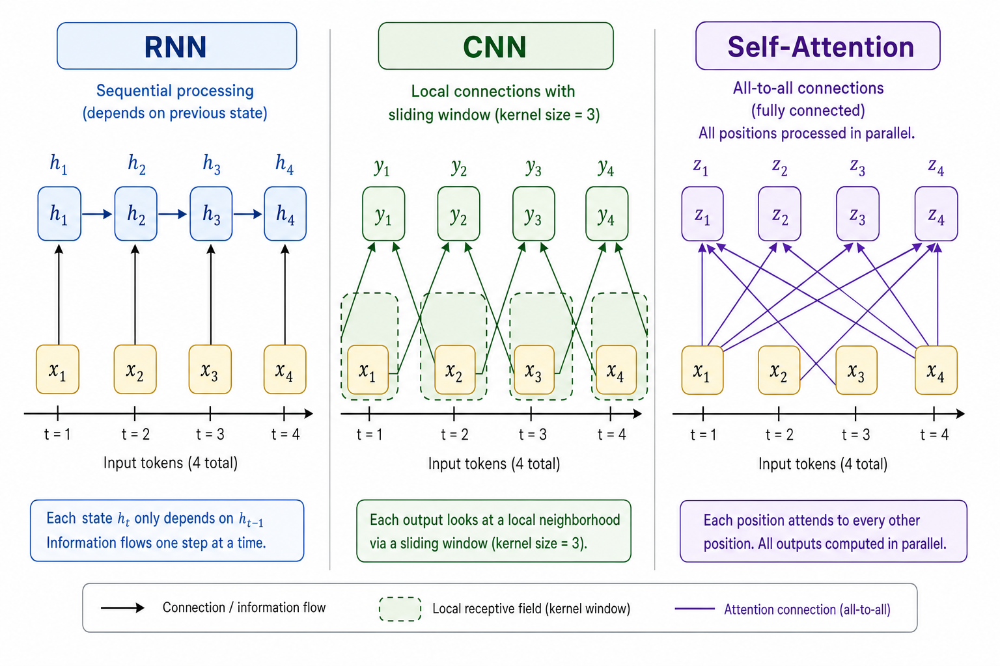
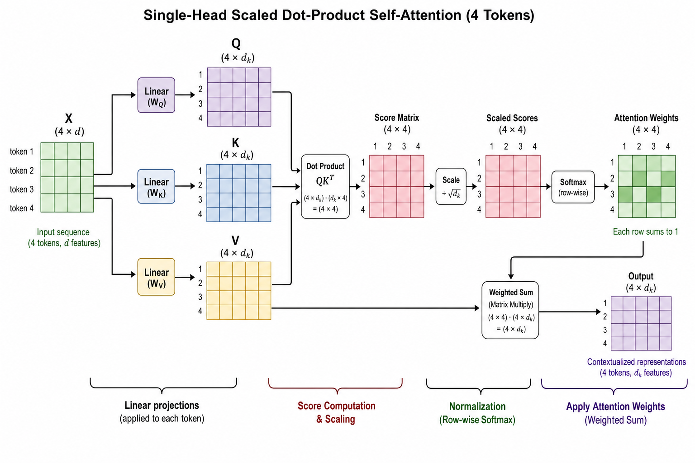
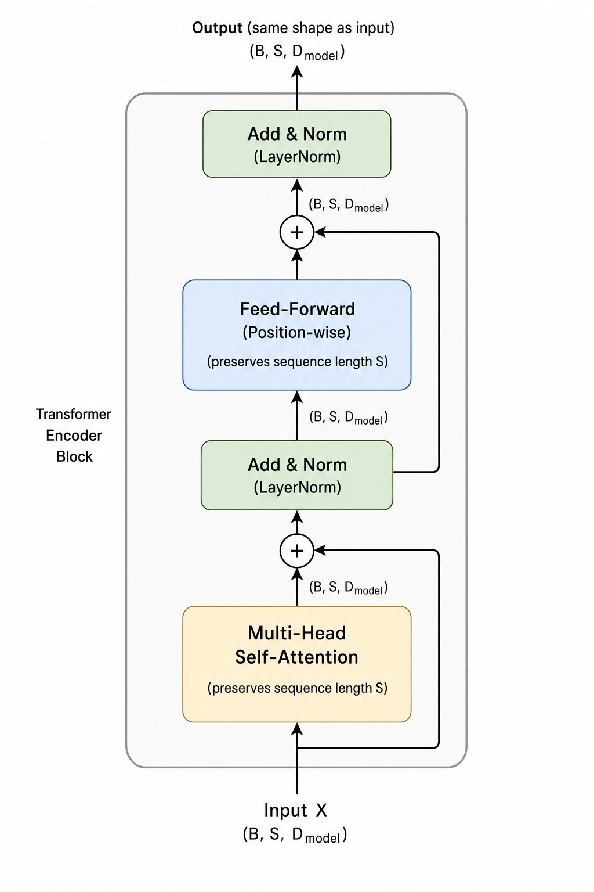

# Demystifying Self-Attention in Transformer Architectures

## From RNNs to Self-Attention: Why Transformers Needed a New Building Block

Classical sequence models were built on recurrence. RNNs and LSTMs process tokens one step at a time, updating a hidden state that’s supposed to summarize everything seen so far. This design has three major issues:

- **Sequential processing**: each timestep depends on the previous one, so you can’t parallelize across positions. Batching helps a bit, but sequence length still throttles throughput.
- **Vanishing/exploding gradients**: even with LSTMs/GRUs, learning dependencies across hundreds or thousands of steps is fragile; gradients either fade or blow up along the chain of recurrent updates.
- **Poor hardware utilization**: modern accelerators want big matrix multiplies; RNNs turn your sequence into a long skinny computation graph that underuses parallel compute.

Convolutional sequence models improve on this. 1D CNNs slide filters over the sequence, so all positions in a layer are computed in parallel. That fixes the “one token at a time” bottleneck. But CNNs have their own trade-offs:

- A single layer only sees a **local window** (kernel size).
- To cover a long context, you stack many layers or increase kernel sizes / dilation, which raises depth, memory, and compute.
- Very deep stacks are harder to train and tune; very wide kernels lose the locality bias that made CNNs appealing.

What we really want is a building block that:

- Captures **long-range dependencies** across the entire sequence.
- Runs **in parallel** across positions.
- Has a **flexible inductive bias**: can focus locally when useful, but also jump to arbitrary positions when needed.

Attention provides this by letting each position compute a **data-dependent weighted average** over representations of tokens. Instead of a fixed window, the model learns weights that say “how relevant is token j to token i?”:

- **Encoder–decoder attention**: a decoder position attends over encoder positions (e.g., target word attending to source sentence).
- **Self-attention**: positions inside the *same* sequence attend to each other (e.g., every token in a sentence looks at all other tokens).

Self-attention can be applied in parallel across all positions and, in one layer, has **global receptive field**. In Transformers, this operation effectively replaces recurrence and wide/deep convolutions as the primary way to mix information across the sequence. The rest of the article will break down how this mechanism is implemented and why it scales so well in practice.


*Sequential RNN processing, local CNN windows, and global self-attention over the same 4-token sequence.*

## Self-Attention Mechanics: From Tokens to Attention Weights

Consider a short sequence of 4 tokens:

> `["The", "cat", "sat", "."]`

1. Each token is mapped to an integer ID via a vocabulary.
2. Each ID is looked up in an embedding matrix to get a dense vector of size `d`.

So you get an input matrix `X` of shape `(4, d)`:

- Row 0: embedding for `"The"`
- Row 1: embedding for `"cat"`
- Row 2: embedding for `"sat"`
- Row 3: embedding for `"."`

At this point, you just have 4 independent vectors. Self-attention will mix information across them.

---

### From embeddings to Q, K, V

Self-attention starts by projecting these embeddings into three different spaces:

- **Query (Q)**: “What am I looking for?”
- **Key (K)**: “What do I contain / expose?”
- **Value (V)**: “What information do I contribute if someone attends to me?”

Mathematically, these are learned linear projections:

- `Q = X W_Q`
- `K = X W_K`
- `V = X W_V`

where `W_Q`, `W_K`, `W_V` are parameter matrices. If:

- `X` is `(4, d)`
- `W_Q`, `W_K`, `W_V` are `(d, d_k)`,

then `Q`, `K`, `V` are each `(4, d_k)`.

Conceptually:

- Each row `Q[i]` expresses how token `i` queries the sequence.
- Each row `K[j]` expresses how token `j` is available to be matched.
- Each row `V[j]` contains the content that can be aggregated.

---

### Attention scores and weights

To decide how much token `i` attends to token `j`, we compare their query and key:

- **score(i, j) = dot(Q[i], K[j])**

In matrix form:

- `scores = Q K^T` → shape `(4, 4)`

Row `i` now contains 4 scores: how token `i` relates to each token (including itself).

These raw scores are turned into probabilities via softmax over each row:

- `weights[i] = softmax(scores[i])`

So each `weights[i]`:

- Is length 4
- Contains non-negative numbers
- Sums to 1

This means **each token attends to every other token** (and itself), with different strengths. For example, `"sat"` might put higher weight on `"cat"` than `"The"`.

---

### Weighted sum of values: the new representations

The final representation of token `i` is a weighted sum of all value vectors:

- `output[i] = Σ_j weights[i, j] * V[j]`

In matrix form:

- `output = weights V` → shapes `(4, 4) @ (4, d_k) = (4, d_k)`

So:

- Each `output[i]` mixes information from every token’s value.
- The mixing pattern is governed by the attention weights row `i`.

You can visualize self-attention as:

- A **4×4 attention matrix** (the weights), where row `i` shows how token `i` distributes its attention.
- Multiplying this matrix by `V` to get new token representations that encode context.

---

### Why the scaling factor 1 / sqrt(d_k)?

Before softmax, scores are scaled:

- `scores_scaled = (Q K^T) / sqrt(d_k)`

Reason: dot products of high-dimensional vectors tend to grow in magnitude with `d_k`. Without scaling:

- Scores can become large in absolute value.
- Softmax becomes very “peaky” (almost one-hot).
- Gradients through softmax can vanish or explode, making training unstable.

Dividing by `sqrt(d_k)` keeps scores in a moderate range so:

- Softmax outputs more nuanced distributions.
- Gradients stay healthier, improving optimization behavior without changing the model’s expressiveness.


*Scaled dot-product self-attention: from embeddings X to Q, K, V, attention weights, and the final context vectors.*

## Multi-Head Self-Attention: Letting the Model Look in Many Ways at Once

A single self-attention head uses one set of learned projections for queries, keys, and values. Concretely, every token embedding `x` is mapped to:
- `q = W_Q x`
- `k = W_K x`
- `v = W_V x`

Those three matrices define **one particular way** of relating tokens: the head can learn “which tokens should attend to which others” according to a single learned similarity geometry. That’s powerful, but restrictive: with one head, the model must squeeze all useful relational patterns (syntax, long-range dependencies, local context, etc.) into a single attention pattern at each layer.

Multi-head attention relaxes that constraint by running several independent, smaller attention mechanisms in parallel. Instead of one large head of dimension `d_model`, you choose:
- `h` heads
- per-head dimension `d_head = d_model / h`

For each head `i` you learn its own projections `W_Q[i]`, `W_K[i]`, `W_V[i]` that map from `d_model → d_head`. Each head computes attention scores and outputs a `d_head`-dimensional representation for every token. These per-head outputs are then concatenated back to a `d_model`-dimensional vector and passed through a final output projection `W_O`.

End-to-end, the process is:

1. **Start from token embeddings** `X ∈ R^{T × d_model}` (T = sequence length).
2. **Project once to all heads’ Q/K/V**:
   - Often implemented as:
     - `Q_all = X W_Q_all`
     - `K_all = X W_K_all`
     - `V_all = X W_V_all`
   - Shapes: `Q_all, K_all, V_all ∈ R^{T × (h * d_head)}`.
3. **Split into heads**:
   - Reshape to `(T, h, d_head)` and treat each `[:, i, :]` as head `i`.
4. **Per-head self-attention**:
   - For each head `i`:
     - `scores_i = softmax(Q_i K_i^T / sqrt(d_head))`
     - `head_out_i = scores_i V_i`
5. **Concatenate & project back**:
   - Stack `head_out_i` along the feature dimension to get `H ∈ R^{T × (h * d_head)} = R^{T × d_model}`.
   - Apply final linear:
     - `Y = H W_O`, where `W_O ∈ R^{d_model × d_model}`.

This is still one layer, but now it can represent **multiple relation types in parallel** because each head has its own parameters and its own similarity space.

Intuitively, different heads often **specialize** during training:
- A head might focus on **local syntax**, strongly attending to neighboring tokens that form phrases.
- Another might track **long-range dependencies**, e.g., relating pronouns to antecedents far away in the sequence.
- Another might emphasize **positional or structural patterns**, like beginnings/ends of sentences or delimiter tokens.
- Yet another might lean toward **semantic grouping**, attending to tokens of similar meaning across the context.

This specialization is not hand-crafted; it emerges because gradient descent finds configurations that minimize the training objective. Multiple heads give the optimizer room to allocate different representational roles without forcing a single attention pattern to cover everything.

There are important trade-offs:

- **Head count vs. width**: For fixed `d_model`, more heads mean smaller `d_head`. Too few heads and you underutilize the representational diversity multi-head attention offers; too many heads and each head becomes too narrow to capture rich patterns.
- **Compute and memory**: Increasing `h` increases:
  - the number of Q/K/V projections,
  - the number of attention score matrices (`T × T` per head),
  - and intermediate activations.
  This raises FLOPs and memory, especially at long sequence lengths.
- **Parallelism**: On modern accelerators, heads are processed in parallel across the `h` dimension. Many moderate-sized heads are often easier to parallelize efficiently than a single very wide head, fitting nicely with batched GEMM kernels and tensor cores.

Finally, not all heads are equally useful. Empirical analyses often find **redundant or low-impact heads** whose removal barely affects performance. This has two implications:
- **Pruning**: You can sometimes drop such heads to reduce inference cost with minimal accuracy loss.
- **Interpretability**: The fact that some heads are clearly specialized and others appear redundant is a reminder that attention patterns tell only part of the story about what the model has learned.

## Implementing a Minimal Self-Attention Layer from Scratch

To connect the math to code, let’s sketch a single-head self-attention layer for a batch of sequences.

### Tensor shapes

Assume input embeddings:

- `x`: `(batch_size, seq_len, d_model)`

We learn three linear projections:

- `W_q`: `(d_model, d_k)` → `Q = x @ W_q` → `(batch_size, seq_len, d_k)`
- `W_k`: `(d_model, d_k)` → `K = x @ W_k` → `(batch_size, seq_len, d_k)`
- `W_v`: `(d_model, d_v)` → `V = x @ W_v` → `(batch_size, seq_len, d_v)`

Core attention:

- Raw scores: `scores = Q @ K^T`  
  Shape: `(batch_size, seq_len, seq_len)`
- After softmax: `attn = softmax(scores, dim=-1)`  
  Same shape: `(batch_size, seq_len, seq_len)`
- Output: `context = attn @ V`  
  Shape: `(batch_size, seq_len, d_v)`

Final projection back to model dimension:

- `W_o`: `(d_v, d_model)` → `out = context @ W_o`  
  Shape: `(batch_size, seq_len, d_model)`

### Minimal PyTorch-like implementation with masking

```python
import math

class SelfAttention:
    def __init__(self, d_model, d_k, d_v):
        # Learned parameters
        self.W_q = Parameter(d_model, d_k)
        self.b_q = Parameter(d_k)
        self.W_k = Parameter(d_model, d_k)
        self.b_k = Parameter(d_k)
        self.W_v = Parameter(d_model, d_v)
        self.b_v = Parameter(d_v)
        self.W_o = Parameter(d_v, d_model)
        self.b_o = Parameter(d_model)

    def __call__(self, x, padding_mask=None, causal_mask=False):
        """
        x: (B, T, d_model)
        padding_mask: (B, T) with 1 for real tokens, 0 for padding, or None
        causal_mask: if True, prevent attending to future positions
        """
        B, T, _ = x.shape

        # Linear projections: (B, T, d_model) -> (B, T, d_k/d_v)
        Q = x @ self.W_q + self.b_q          # (B, T, d_k)
        K = x @ self.W_k + self.b_k          # (B, T, d_k)
        V = x @ self.W_v + self.b_v          # (B, T, d_v)

        # Scaled dot-product attention
        # scores: (B, T, T)
        scores = (Q @ K.transpose(0, 2, 1)) / math.sqrt(Q.shape[-1])

        # Build mask in score space if provided
        if padding_mask is not None:
            # padding_mask: (B, T) -> (B, 1, T) to broadcast over query positions
            # 1 for keep, 0 for pad
            mask = padding_mask[:, None, :]   # (B, 1, T)
            # Set padded keys to large negative so softmax ~ 0 there
            scores = scores + (1.0 - mask) * -1e9

        if causal_mask:
            # Lower-triangular mask: (T, T), 1 where allowed, 0 where blocked
            i = range(T)
            j = range(T)
            causal = [[1 if j_idx <= i_idx else 0 for j_idx in j] for i_idx in i]
            causal = to_tensor(causal)  # (T, T)
            scores = scores + (1.0 - causal) * -1e9

        # Optional numerical-stability trick: subtract max before softmax
        # scores = scores - scores.max(axis=-1, keepdims=True)

        attn = softmax(scores, axis=-1)       # (B, T, T)

        # Weighted sum of values: (B, T, T) @ (B, T, d_v) -> (B, T, d_v)
        context = attn @ V                    # (B, T, d_v)

        # Output projection back to d_model
        out = context @ self.W_o + self.b_o   # (B, T, d_model)
        return out, attn


# Minimal "Parameter" and ops to keep this framework-agnostic
class Parameter:
    def __init__(self, in_dim, out_dim=None):
        if out_dim is None:
            # vector
            self.data = randn(in_dim).astype("float32")
        else:
            self.data = (randn(in_dim, out_dim) / math.sqrt(in_dim)).astype("float32")

    def __array__(self):
        return self.data
```

You can imagine `@`, `transpose`, `softmax`, and `randn` as thin wrappers around your chosen tensor library.

### What is learned vs. what is just math?

Learned parameters:

- Weight matrices: `W_q`, `W_k`, `W_v`, `W_o`
- Bias vectors: `b_q`, `b_k`, `b_v`, `b_o`

Pure tensor operations (no learned parameters):

- Matrix multiplications `x @ W_*`, `Q @ K^T`, `attn @ V`
- Scaling by `1 / sqrt(d_k)`
- Masking logic (adding `-1e9` to masked positions)
- Softmax over the last dimension
- Transpose operations

These implement the concept you saw earlier: queries matching keys to compute attention weights, which then mix the values.

### Validating correctness

Simple checks:

- Shape sanity:
  - Input: `(B, T, d_model)`
  - Output: `(B, T, d_model)`
  - Attention: `(B, T, T)`
- Run a tiny example:
  - `B = 2`, `T = 3`, `d_model = 4`, random `x`.
  - Confirm no dimension mismatch and finite outputs.
- Mask behavior:
  - Create an input with some tokens marked as padding.
  - Compare attention weights with and without those tokens (e.g., set them to zeros).
  - Verify that positions masked out get near-zero attention probabilities and do not influence the context vectors.

### Numerical stability tips

- Use at least `float32` for projections and scores; mixed precision is fine if your framework keeps accumulations in higher precision.
- If your framework’s `softmax` isn’t numerically stable, manually subtract the max per row:
  ```python
  scores = scores - scores.max(axis=-1, keepdims=True)
  attn = softmax(scores, axis=-1)
  ```
- Avoid using extremely large negative values other than a safe sentinel for masking (e.g., `-1e9` in float32); keep them consistent across the model.

## Positional Information and Masking: Making Self-Attention Respect Order and Context

Raw self-attention treats its inputs as a **set**, not a sequence. If you shuffle the token embeddings, the attention mechanism (dot products between queries and keys, followed by softmax) produces the same pattern up to that permutation. There is nothing in the math that encodes *position*; only content matters. Without extra signals, “cat sat” and “sat cat” are indistinguishable, which is unacceptable for language, code, or any ordered data.

### Absolute positional encodings

To break this permutation invariance, we inject **positional encodings** into the token representations before self-attention. For a sequence of token embeddings `E` of shape `[seq_len, d_model]`:

- Construct a positional matrix `P` of the same shape, where `P[i]` is the encoding for position `i`.
- Form `X = E + P` and feed `X` into the attention layers.

Two common absolute schemes:

- **Fixed sinusoidal**:
  - Position `i` gets a vector built from sines/cosines of different frequencies.
  - Gives a smooth, continuous notion of position; supports extrapolation to unseen lengths (to some degree).
- **Learned positional vectors**:
  - `P` is a trainable embedding table indexed by position.
  - More flexible but tied to the maximum length seen in training.

In both cases, each token embedding gains a position-dependent offset, so self-attention can learn patterns like “pay more attention to tokens nearby in index space” or “this word is likely the start of a sentence.”

### Relative positional schemes (conceptual)

Absolute encodings tie position to a global index: “this is token #17.” **Relative** schemes instead encode *distances* between tokens inside the attention itself, e.g., “this key is 3 steps to the left of this query.”

Conceptually:

- Absolute: attention sees “token content + absolute slot number.”
- Relative: attention sees “token content + their relative offset.”

Relative encodings can better capture translation-invariant patterns (e.g., “previous token,” “next line”) and often generalize more gracefully to longer sequences, but they complicate the attention computation.

### Padding masks for variable-length sequences

Batches rarely consist of uniform-length sequences. We pad shorter sequences with a special PAD token to reach a common length. The model must **ignore** these PAD positions in attention; otherwise it can learn spurious correlations.

We construct a **padding mask** with shape `[batch, seq_len]`, where `1` (or `True`) indicates real tokens and `0` indicates padding. Before softmax over attention scores `scores` (shape `[batch, heads, seq_len, seq_len]`), we add a large negative value (effectively `-inf`) to all scores pointing to padding positions:

```python
# scores: [B, H, T, T]
# pad_mask: [B, T] where 1 = real token, 0 = pad
# Expand to broadcast over heads and query positions
attn_mask = pad_mask[:, None, None, :]        # [B, 1, 1, T]

neg_inf = -1e9
scores = scores + (1.0 - attn_mask) * neg_inf
attn_weights = softmax(scores, dim=-1)
```

Now, attention weights to PAD tokens are effectively zero.

### Causal (look-ahead) masks for autoregressive models

For autoregressive generation, token at position `t` must not see tokens at positions `> t`. A **causal mask** enforces this by masking out “future” keys for each query.

We build a lower-triangular mask of shape `[T, T]`, where positions above the diagonal are invalid:

```python
T = seq_len
causal = torch.tril(torch.ones(T, T))  # 1 = allowed, 0 = masked
scores = scores + (1.0 - causal) * neg_inf
attn_weights = softmax(scores, dim=-1)
```

Effect:

- Position `0` attends only to itself.
- Position `t` attends to `[0…t]`, never `[t+1…T-1]`.
- During decoding, this guarantees left-to-right generation with no information leak.

Causal masks and padding masks are often combined (e.g., by logical AND) to handle both constraints simultaneously.

### Practical debugging tips

When things go wrong with order or masking, it often shows up in:

- **Attention maps**:
  - Visualize `attn_weights` as heatmaps.
  - For causal attention: verify there is no mass above the main diagonal.
  - For padding: verify columns corresponding to PAD tokens are dark across all queries.
- **Mask polarity mistakes**:
  - Common bug: treating `1` as “masked” instead of “keep,” or vice versa.
  - Confirm how your implementation expects the mask (keep vs. block semantics).
- **Broadcasting shape errors**:
  - Masks mis-broadcast across heads or batch dims can silently apply to the wrong tokens.
  - Print shapes and use assertions during development.
- **Order sensitivity checks**:
  - Run the model on a sequence and a shuffled version.
  - If predictions hardly change, positional information may not be wired correctly (e.g., positional encodings not added, or using the same encoding for every position).

Ensuring that positional encodings are applied to the right tensors, and that masks are correctly shaped and signed, is crucial for making self-attention truly sequence-aware.

## Edge Cases, Failure Modes, and Performance Considerations

Self-attention is powerful but expensive. Its time and memory cost scales as \(O(n^2 \cdot d)\), where \(n\) is sequence length and \(d\) is the per-head hidden size. The core offender is the attention matrix of shape \((\text{batch} \times \text{heads}, n, n)\). Doubling sequence length multiplies this matrix size by 4, and memory for activations often dominates. For example, going from \(n=512\) to \(n=2{,}048\) increases the attention matrix size by 16×, which in turn can force you to cut batch size proportionally just to fit in GPU RAM. At large \(n\), you quickly hit a wall where you must trade off batch size (which stabilizes optimization) against sequence length (which captures more context).

Beyond raw cost, attention has characteristic failure modes:

- **Attention collapse (uniform weights):** Each query distributes its probability mass almost evenly across all keys. You’ll see attention weights near \(1/n\) with high entropy. Models in this regime often underfit and behave like shallow bag-of-words encoders.
- **Overly sharp attention:** A query puts almost all weight on a single token (entropy near zero) across most positions. This can turn the model into a brittle pointer mechanism, over-relying on specific positions and failing to generalize.
- **Trivial-pattern heads:** Some heads lock onto punctuation, separators, or padding tokens and never evolve. A few such heads are often harmless, but if most heads focus on low-information tokens, the model learns very little about semantics.

Numerical stability issues are a frequent culprit behind training divergence:

- The unscaled dot-product \(QK^\top\) can grow with \(\sqrt{d}\). If you forget the usual \(1/\sqrt{d}\) scaling or use an unstable softmax, attention logits can become very large in magnitude.
- Large positive logits push softmax outputs toward one-hot; large negative logits push them toward zero. In finite precision, this spells:
  - **NaNs/inf in activations or gradients** (overflows in exponentials).
  - **Loss spikes or complete divergence** after a few steps.
- Incorrect normalization (e.g., missing layer norm, wrong dtype casts) exacerbates these issues.

Mitigating performance bottlenecks in practice usually involves several levers:

- **Gradient checkpointing:** Recompute some intermediate activations during backprop instead of storing them. This reduces memory at the cost of extra compute, letting you handle longer sequences or bigger batches.
- **Mixed precision (e.g., FP16/BF16 for activations, FP32 for master weights):** Cuts memory and boosts throughput while maintaining stability if you keep softmax and normalizations in higher precision or use loss scaling.
- **Sequence bucketing:** Group examples with similar sequence lengths so you don’t pay the \(O(n^2)\) price for padding. This reduces wasted compute on pad tokens and often yields a direct throughput gain.
- **Batch/sequence length trade-offs:** When running out of memory, first reduce max sequence length or clip examples; if that’s not possible, reduce batch size. For some tasks, more (shorter) examples per step are better than fewer long ones.

Adding observability around attention helps catch problems early:

- **Log summary statistics** per head and layer:
  - Entropy of attention distributions (low = sharp, high = diffuse).
  - Max and mean attention weight, ratio of tokens getting near-zero attention.
- **Detect dead heads:** Heads whose outputs or gradients are near zero across batches, or whose entropy/max-weight statistics barely change over training.
- **Inspect a few maps:** Periodically visualize attention maps for a fixed diagnostic batch. You’re looking for:
  - All-head uniform blobs (collapse).
  - Single-column “spikes” everywhere (over-sharp).
  - Heads exclusively lighting up on [PAD] or punctuation.

Finally, be wary of **extreme sequence lengths** and **imbalanced token distributions**:

- Very long sequences magnify any instability and magnify the cost of mistakes in masking or scaling.
- Many pad tokens or skewed vocab distributions can cause heads to:
  - Attend disproportionately to pads if masking is wrong.
  - Learn shortcuts keyed to rare markers rather than content.

Design targeted tests:

- Unit tests that **verify masking**: attention to padded positions must be (near) zero.
- Synthetic sequences with controlled patterns (e.g., one meaningful token in a sea of pads) to confirm the model learns to attend to the right positions.
- Stress tests at the max supported sequence length and batch size, checking:
  - No NaNs or infs.
  - Reasonable attention statistics (no universal collapse or saturation).

## Where Self-Attention Fits in the Transformer Block and Beyond

A standard transformer block is a stack of a few core components:

1. **Multi-head self-attention**
2. **Residual (skip) connection** around the self-attention
3. **Layer normalization**
4. **Position-wise feed-forward network (FFN)**
5. Another **residual connection** and **layer norm** around the FFN

In pseudocode, omitting details like dropout and positional encodings:

```python
def transformer_block(x):
    # x: [batch, seq_len, d_model]

    # Self-attention sub-layer
    attn_out = self_attention(x)              # [batch, seq_len, d_model]
    x = x + attn_out                          # residual
    x = layer_norm(x)

    # Feed-forward sub-layer
    ff_out = feed_forward(x)                  # applied per position
    x = x + ff_out                            # residual
    x = layer_norm(x)

    return x
```

Self-attention performs **global context mixing**: each token can read from all other tokens in the sequence, weighting them adaptively. The FFN then acts as a **local nonlinear transformation** applied independently to each token embedding (same MLP parameters for every position). Intuitively:

- Self-attention: “Who should I listen to?”
- FFN: “Given what I heard, how should I transform my own representation?”

Together, they alternate between sharing information across positions and increasing the representational power at each position.


*Standard transformer block with multi-head self-attention, residual connections, layer norms, and position-wise feed-forward network.*

### Encoder vs. Decoder: Masking and Cross-Attention

In the **encoder**, you typically have:

- **Self-attention over the entire input sequence**, with no causal mask.
- Every token can attend to every other token (subject to padding masks).

In the **decoder** (for sequence-to-sequence models), each block usually has:

1. **Masked self-attention** over the generated tokens so far: a causal mask prevents a position from attending to future positions.
2. **Encoder–decoder cross-attention**:
   - Queries come from decoder states.
   - Keys/values come from encoder outputs.
   - No causal mask here; the decoder can see the full encoded source.

This separation lets the encoder build a rich representation of the source, while the decoder conditions its next-token predictions on both its own history and the encoded source.

### Role in Common Applications

Across domains, self-attention’s defining feature is **token–token interaction**:

- **Language modeling**: tokens are words or subword units; masked self-attention lets each position attend to all previous tokens to predict the next one.
- **Machine translation**:
  - Encoder self-attention models dependencies across source tokens.
  - Decoder self-attention plus cross-attention model both target-side structure and alignment to source tokens.
- **Vision Transformers**:
  - Images are split into patches (tokens).
  - Self-attention enables long-range spatial interactions between patches, unlike small convolution kernels.
- **Multimodal models**:
  - Tokens can be text, image patches, audio frames, etc.
  - Self-attention (and cross-attention) tie together heterogeneous token streams, enabling joint reasoning across modalities.

The common pattern is a flexible, content-based connectivity graph over tokens, learned end-to-end.

### Variants to Tackle Quadratic Cost

Naive self-attention has **O(n²)** cost in sequence length. Broad families of variants reduce this in different ways:

- **Sparse or local attention**: restrict attention to a window or pattern (e.g., banded, block, or strided) so each token attends to fewer neighbors.
- **Low-rank / kernel / linearized attention**: approximate the full attention matrix by factorized or kernel-based forms to get near **O(n)** or **O(n log n)** behavior.
- **Hierarchical or clustered attention**: group tokens into clusters or levels, attending within and/or between groups to approximate global attention more cheaply.

These trade some expressivity for better scaling.

### When Self-Attention Is Overkill vs. Beneficial

Self-attention shines when:

- Sequences are **moderate to long**, with **non-local dependencies** (language, code, documents, videos).
- You have enough data and capacity to exploit rich token–token patterns.
- You can afford the **memory and compute** overhead, especially at inference.

It may be overkill when:

- Sequences are **short** and local structure dominates (e.g., small tabular inputs, tiny fixed-size vectors).
- You mainly need simple per-token or per-example transformations (small MLPs or CNNs may suffice).
- Deployment constraints (latency, memory, hardware) are tight relative to sequence length.

In system design, treat self-attention as a powerful but expensive primitive. Use it where **global context and flexible interactions are central to the task**, and consider simpler or approximated mechanisms where locality, small context, or strict resource limits dominate the requirements.
