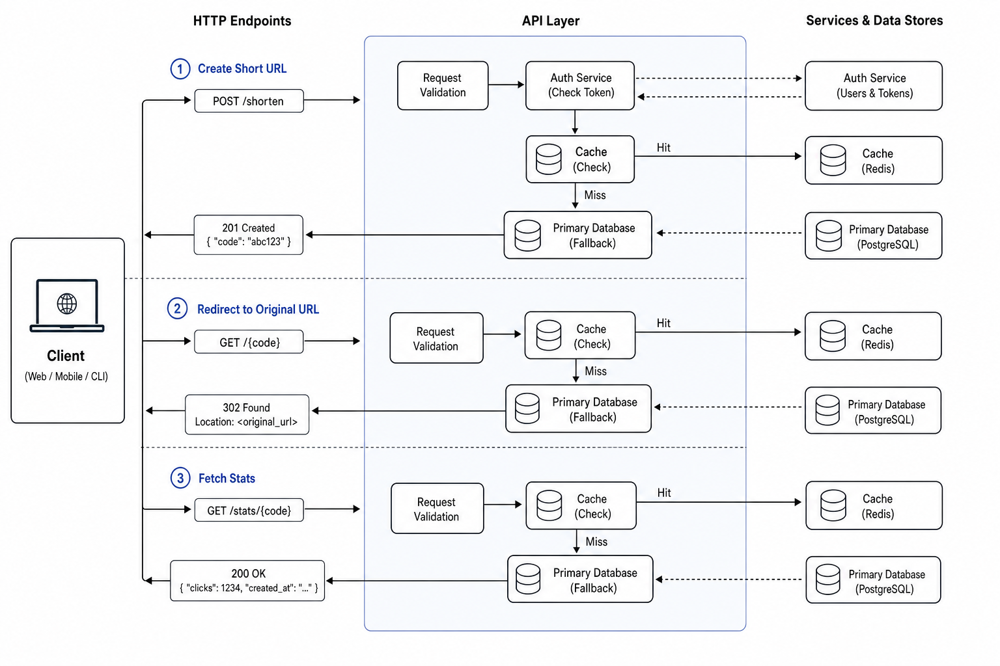
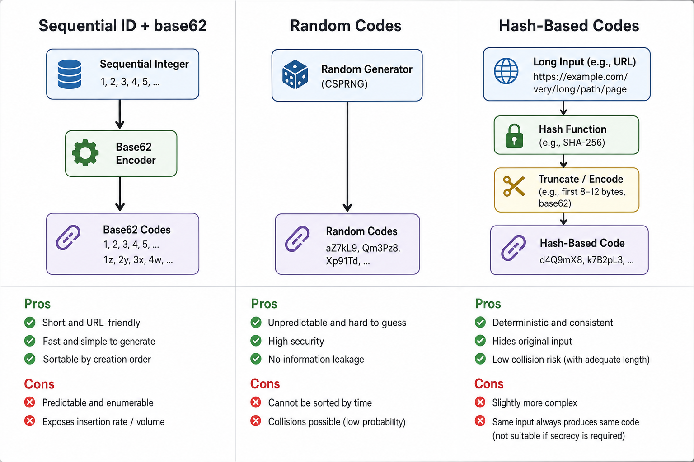
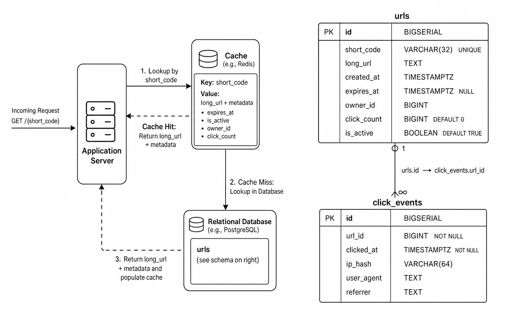

# Designing a URL Shortener Step by Step (From Requirements to Implementation)


*High-level request flows for create, redirect, and stats in a URL shortener.*

## Clarify Requirements and Core API

Start by pinning down what the service must do and how clients will talk to it.

### Functional requirements

At minimum, the system should:

- Shorten long URLs into compact codes.
- Redirect users to the original URL when they hit the short link.
- Support optional custom aliases (e.g., `/my-campaign`).
- Store link metadata:
  - Creation time
  - Owner (user or API key)
- Provide basic analytics:
  - Total click count
  - Last accessed time (optional)

Out of scope for now: complex analytics (geo, device), bulk operations, or QR generation.

### Non-functional requirements

Assume a read-heavy workload:

- Read/write ratio: ~100:1 redirects to creations/updates.
- Target redirect latency: p95 < 50 ms from edge (excluding client network).
- Availability: 99.9%+ for redirect API; slightly lower is acceptable for management/analytics endpoints.
- Consistency:
  - Strong consistency for creating a code (no two URLs share the same code).
  - Eventual consistency is acceptable for analytics counters (click counts may lag by a few seconds).

We’ll start with a single-region deployment, with a clear path to multi-region reads later.

### External API surface

Minimal HTTP API (JSON for management, 3xx for redirects):

1. **Create short URL**

   - `POST /shorten`
   - Request body:
     ```json
     {
       "long_url": "https://example.com/some/very/long/path",
       "custom_alias": "my-campaign-123",   // optional
       "expires_at": "2026-12-31T23:59:59Z" // optional
     }
     ```
   - Response:
     - `201 Created`:
       ```json
       {
         "code": "a1B9xY",
         "short_url": "https://sho.rt/a1B9xY",
         "long_url": "https://example.com/some/very/long/path",
         "owner_id": "user-123",
         "created_at": "2026-07-26T12:34:56Z",
         "expires_at": null
       }
       ```
     - `400 Bad Request`: invalid URL, invalid alias format, or URL too long.
     - `409 Conflict`: custom alias already taken.
     - `401 Unauthorized` / `403 Forbidden`: if auth is required for creation.

2. **Redirect**

   - `GET /{code}`
   - Behavior:
     - `301 Moved Permanently` or `302 Found` with `Location: <long_url>` on success.
     - `404 Not Found`: unknown code, expired URL.
     - `410 Gone`: optionally distinguish explicitly deleted links.
   - No JSON body on success; errors can return a simple error JSON for API clients.

3. **Stats**

   - `GET /stats/{code}`
   - Response:
     - `200 OK`:
       ```json
       {
         "code": "a1B9xY",
         "long_url": "https://example.com/some/very/long/path",
         "owner_id": "user-123",
         "created_at": "2026-07-26T12:34:56Z",
         "expires_at": null,
         "click_count": 1234,
         "last_accessed_at": "2026-07-26T13:00:01Z"
       }
       ```
     - `404 Not Found` for unknown/expired code.
     - `403 Forbidden` if caller is not allowed to see stats.

### Client flows and error handling

- **Web clients**:
  - Use `POST /shorten` via form or XHR.
  - On success, display `short_url`.
  - On errors (e.g., `400`, `409`), show validation messages.
  - For redirects, browsers simply follow `3xx` responses.

- **Mobile clients**:
  - Same APIs, but handle JSON errors explicitly.
  - Might open redirect URLs in-app web views; rely on `GET /{code}` redirects.

- **Programmatic clients (backend services, CLIs)**:
  - Use API keys or OAuth for `POST /shorten` and `GET /stats/{code}`.
  - Parse status codes:
    - `400` ⇒ input bug.
    - `401/403` ⇒ auth problem.
    - `404/410` ⇒ link doesn’t exist or is gone; callers should not retry blindly.

Error representation (for JSON endpoints):

```json
{
  "error": "invalid_url",
  "message": "URL must be absolute and use http or https."
}
```

### Design constraints

These choices shape later design:

- **Deployment scope**:
  - Start single-region for simplicity.
  - Plan for:
    - Multi-region read replicas for `GET /{code}`.
    - Possibly geo-DNS or anycast later.

- **AuthN/AuthZ**:
  - Public, unauthenticated redirects (`GET /{code}`).
  - Authenticated management:
    - `POST /shorten`, `GET /stats/{code}`, future update/delete.
  - Each link is owned by `owner_id`; only the owner (or admins) can manage/view detailed stats.

- **Maximum URL length**:
  - Enforce a cap (e.g., 2–4 KB) to avoid abusing storage and to keep DB indexes reasonable.
  - Validate before insertion and return `400 Bad Request` if exceeded.

These requirements and APIs anchor the rest of the system design: data model, storage, caching, and scaling decisions all derive from them.

## Designing the Short URL Format and Code Generation Strategy


*Comparing sequential, random, and hash-based short code generation strategies.*

First, pick an alphabet and length. A common choice is base-62:

- Alphabet: `0-9` (10) + `a-z` (26) + `A-Z` (26) → 62 chars
- Length: 7–10 characters

Keyspace = `62^L`. For `L = 7`, `62^7 ≈ 3.5e12` (trillions of URLs). For `L = 8`, `62^8 ≈ 2.2e14`. That’s plenty for most products; choose longer if you expect extreme scale or high deletion/reuse constraints.

### Comparing code generation strategies

1. **Sequential ID + base-N encoding**
   - Process: maintain an auto-incrementing integer, encode to base-62.
   - Pros: no collisions by construction, simple to shard (ID ranges per shard).
   - Cons: codes are predictable; possible information leak about volume/age.

2. **Random codes**
   - Process: generate random 7–10 char strings from the alphabet.
   - Pros: opaque, harder to enumerate; better privacy.
   - Cons: non-zero collision probability → must check and retry; sharding needs extra thought (e.g., consistent hashing).

3. **Hash-based codes (from long URL)**
   - Process: hash long URL, truncate to N chars.
   - Pros: same long URL → same code (idempotence); no DB read to find existing mapping if you accept “one URL → one code”.
   - Cons: higher collision risk when truncating; hard to change destination later; hash reveals structure (for some hashes).

### A concrete scheme

A pragmatic baseline:

- Primary key: auto-incrementing `BIGINT` (or a distributed ID like Snowflake).
- Short code: base-62 encoding of that integer.

Storage-level protections:

- Table column `code` with `UNIQUE` constraint.
- On insert:
  1. Get next ID.
  2. Encode to base-62.
  3. Insert `(code, long_url, ...)`.
  4. If conflict (extremely rare unless multiple generators), retry with a new ID.

In SQL terms, this looks like:

```sql
CREATE TABLE urls (
  id        BIGSERIAL PRIMARY KEY,
  code      VARCHAR(16) NOT NULL UNIQUE,
  long_url  TEXT NOT NULL
);
```

The application generates `code` from `id` before insert; the unique index guarantees no collisions even across concurrent writers.

### Custom aliases and reserved words

Support custom aliases by:

- Allowing clients to provide `desired_code`.
- Validating on write:
  - Pattern: `^[0-9A-Za-z_-]{1,32}$` (or whatever you accept).
  - Block reserved words list: `["admin", "api", "login", "support", ...]`.
  - Check uniqueness: if `desired_code` already exists, reject.

You can store reserved codes in:

- A small in-memory set in the app, and/or
- A dedicated table with a unique constraint on `code`.

Any write that tries to use a reserved code must fail fast.

### Human factors and usability

Design the alphabet and policy with people in mind:

- **Avoid ambiguous characters**: many systems drop `0/O`, `1/l/I` to reduce misreads in print/voice.
- **Case sensitivity**: base-62 uses case-sensitive codes; if you expect lots of manual typing, you might prefer case-insensitive codes (e.g., base-32) at the cost of a larger length.
- **Opacity vs guessability**:
  - Sequential IDs are easy to enumerate and approximate creation order; not great for private or sensitive links.
  - Random or hash-based codes are less predictable and better for privacy, at the cost of more complex generation and collision handling.

For many production systems, a hybrid approach works well: internal IDs for storage/sharding, encoded to short, mostly opaque codes, plus optional user-specified aliases with strict validation and a maintained reserved-word list.

## Data Model and Storage Choices


*Core data model for URL mappings, click analytics, and the cache layer.*

### Core `urls` entity

Define a single primary table/collection for URL mappings:

- `id` (BIGINT / UUID): Internal primary key, never exposed. Used for joins and sharding.
- `short_code` (VARCHAR, e.g., 8–16 chars): Public identifier in the short URL. Must be unique.
- `long_url` (TEXT): Original URL. May be large and contain query strings.
- `created_at` (TIMESTAMP): When the short link was created. Used for audits and retention policies.
- `expires_at` (TIMESTAMP NULL): Optional expiration time. `NULL` means “no expiry”.
- `owner_id` (VARCHAR / BIGINT): User or tenant ID, enables per-user queries and auth checks.
- `click_count` (BIGINT): Denormalized aggregate count of clicks for quick reads.
- Optional extra metadata: e.g., `is_active` (BOOLEAN) for soft-deletes.

### Relational vs key-value for `short_code → long_url`

**Relational DB (e.g., Postgres, MySQL)**

- Pros:
  - Strong consistency, transactions, and unique constraints on `short_code`.
  - Easy secondary indexes for `owner_id`, `expires_at`.
  - Flexible queries (per-user links, expired links, reporting).
- Cons:
  - Might become a bottleneck at very high read/write scale without caching or sharding.

**Key-value store (e.g., DynamoDB, Redis, Cassandra)**

- Pros:
  - Very fast, cheap reads for `short_code → long_url`.
  - Naturally scales horizontally.
- Cons:
  - Enforcing global uniqueness on `short_code` is trickier (application-level or conditional writes).
  - Secondary queries (list by `owner_id`, expired links) require additional data models or other stores.

A common pattern: relational DB as the system of record, plus an in-memory key-value cache (Redis) for hot lookups.

### Example schema

Relational SQL-style schema:

```sql
CREATE TABLE urls (
  id           BIGSERIAL PRIMARY KEY,
  short_code   VARCHAR(32) NOT NULL,
  long_url     TEXT NOT NULL,
  created_at   TIMESTAMPTZ NOT NULL DEFAULT NOW(),
  expires_at   TIMESTAMPTZ NULL,
  owner_id     BIGINT NOT NULL,
  click_count  BIGINT NOT NULL DEFAULT 0,
  is_active    BOOLEAN NOT NULL DEFAULT TRUE
);

CREATE UNIQUE INDEX idx_urls_short_code
  ON urls (short_code);

CREATE INDEX idx_urls_owner
  ON urls (owner_id, created_at DESC);

CREATE INDEX idx_urls_expiration
  ON urls (expires_at)
  WHERE expires_at IS NOT NULL;

CREATE INDEX idx_urls_active
  ON urls (is_active);
```

NoSQL key-value layout (conceptual):

- Partition key: `short_code`
- Attributes: `long_url`, `owner_id`, `created_at`, `expires_at`, `click_count`, `is_active`
- Global secondary index: `owner_id` (for listing a user’s links)
- TTL policy on `expires_at` if the store supports it.

### Analytics: events vs aggregates

For click tracking you have two main layers:

1. **Aggregated counters (`click_count` on `urls`)**
   - Fast read for “how many clicks?”.
   - Updated:
     - Either synchronously on redirect (simple but higher write load), or
     - Asynchronously via a queue / stream consumer.

2. **Detailed events (`click_events` table)**
   - Stores per-click data: IP, user-agent, referrer, timestamp, geo, etc.
   - Useful for analytics dashboards and fraud detection.

Example event table:

```sql
CREATE TABLE click_events (
  id         BIGSERIAL PRIMARY KEY,
  url_id     BIGINT NOT NULL REFERENCES urls(id),
  clicked_at TIMESTAMPTZ NOT NULL DEFAULT NOW(),
  ip_hash    VARCHAR(64) NULL,
  user_agent TEXT NULL,
  referrer   TEXT NULL
);

CREATE INDEX idx_click_events_url_time
  ON click_events (url_id, clicked_at DESC);
```

To balance load vs insight:

- Write `click_events` in an append-only fashion (cheap writes).
- Periodically (e.g., every minute) aggregate events by `url_id` and increment `urls.click_count` in batches.
- For high scale, move raw events to a log system (e.g., Kafka) and data warehouse, and only keep short-term events in OLTP.

### Data lifecycle and cost control

Handling lifecycle is key to controlling storage and operational costs.

- **Expiration**:
  - Respect `expires_at` and/or `is_active` when redirecting.
  - Exclude expired links from user lists unless they explicitly filter for them.
- **Soft delete**:
  - Set `is_active = FALSE` (and possibly `expires_at = NOW()`).
  - Pros: Fast, safe (easy restore), preserves analytics history.
  - Cons: Storage keeps growing; queries must filter `is_active`.
- **Hard delete**:
  - Physically delete rows from `urls` and `click_events`.
  - Typically done by background jobs:
    - Scan for `expires_at < NOW()` and `is_active = FALSE`.
    - Delete in small batches to avoid long transactions and lock contention.
  - Optionally archive to cheaper storage (e.g., object store) before deletion for compliance.

Background jobs / cron tasks:

- Periodic cleanup of:
  - Expired links past a grace period (e.g., 30 days).
  - Old `click_events` that are already aggregated or exported.
- Rebuild or VACUUM tables to reclaim space in relational DBs.

These lifecycle policies keep hot data small, improve cache effectiveness, and control database and analytics storage costs.

## End-to-End Request Flow and Minimal Implementation Sketch

### Flow: `POST /shorten`

1. **Receive request**
   - Body: JSON like `{"url": "https://example.com/long/path?x=1"}`.
2. **Validate input URL**
   - Non-empty, parseable, allowed scheme (`http`/`https`).
   - If invalid → `400 Bad Request` with an error payload.
3. **Normalize URL**
   - Ensure scheme (e.g., prepend `https://` if missing and policy allows).
   - Canonicalize minor differences if desired (strip whitespace, normalize host case).
4. **Check existing mapping (optional)**
   - Query storage by normalized long URL.
   - If found and still active → return existing short URL (idempotent behavior).
5. **Generate ID/code**
   - Produce unique ID (e.g., incrementing counter or random 64-bit).
   - Encode to base62 (e.g., `aZ3f9K`).
6. **Persist mapping**
   - Insert `{code, long_url, created_at, is_active, click_count, expires_at?}`.
   - On DB error → `500 Internal Server Error`.
7. **Return response**
   - JSON: `{"short_url": "https://sho.rt/aZ3f9K"}` with `201 Created`.

### Flow: `GET /{code}`

1. **Receive request**
   - Path parameter `code`.
2. **Lookup by code**
   - Fetch record by `code`.
   - If not found → `404 Not Found`.
3. **Check status**
   - If `is_active == false` or `expires_at < now` → `404 Not Found` (or `410 Gone`).
4. **Update click counters**
   - Increment `click_count`.
   - Either:
     - Synchronously: update in same request (simpler, slightly slower).
     - Asynchronously: enqueue event (faster, more infra).
5. **Redirect**
   - Respond with:
     - `301 Moved Permanently` for stable URLs.
     - Or `302 Found` if target may change.
   - `Location` header set to `long_url`.

### Minimal Implementation Sketch

Below is a small, concrete sketch using an in-memory map to represent storage. Error types are mapped to HTTP status codes at the handler layer.

```python
# Pseudo-Python for clarity; replace with your language of choice.

import time
from urllib.parse import urlparse

class UrlRecord:
    def __init__(self, long_url, is_active=True, expires_at=None):
        self.long_url = long_url
        self.is_active = is_active
        self.expires_at = expires_at  # unix timestamp or None
        self.click_count = 0

class InMemoryStore:
    def __init__(self):
        self.by_code = {}      # code -> UrlRecord
        self.by_long_url = {}  # normalized_long_url -> code
        self.next_id = 1

    def _generate_code(self):
        # trivial base62-ish encoding for demo
        alphabet = "0123456789abcdefghijklmnopqrstuvwxyzABCDEFGHIJKLMNOPQRSTUVWXYZ"
        n = self.next_id
        self.next_id += 1
        s = []
        while n > 0:
            s.append(alphabet[n % 62])
            n //= 62
        return "".join(reversed(s or ["0"]))

    def create_or_get(self, long_url):
        # Optional deduplication
        if long_url in self.by_long_url:
            code = self.by_long_url[long_url]
            return code, self.by_code[code]

        code = self._generate_code()
        rec = UrlRecord(long_url=long_url)
        # Simulate possible DB failure
        try:
            self.by_code[code] = rec
            self.by_long_url[long_url] = code
        except Exception as e:
            raise StorageError(str(e))
        return code, rec

    def find_by_code(self, code):
        try:
            return self.by_code.get(code)
        except Exception as e:
            raise StorageError(str(e))

class InvalidUrlError(Exception):
    pass

class NotFoundError(Exception):
    pass

class InactiveOrExpiredError(Exception):
    pass

class StorageError(Exception):
    pass

store = InMemoryStore()

def normalize_url(raw):
    raw = raw.strip()
    if "://" not in raw:
        raw = "https://" + raw  # simple policy
    parsed = urlparse(raw)
    if not parsed.scheme or not parsed.netloc:
        raise InvalidUrlError("Invalid URL")
    # minimal normalization; extend as needed
    return raw

def shortenUrl(raw_long_url):
    try:
        normalized = normalize_url(raw_long_url)
        code, _ = store.create_or_get(normalized)
        return {"status": 201, "body": {"code": code}}
    except InvalidUrlError as e:
        return {"status": 400, "body": {"error": str(e)}}
    except StorageError as e:
        return {"status": 500, "body": {"error": "storage_error"}}


def resolveCode(code):
    try:
        rec = store.find_by_code(code)
        if rec is None:
            raise NotFoundError()
        now = int(time.time())
        if not rec.is_active or (rec.expires_at and rec.expires_at < now):
            raise InactiveOrExpiredError()

        # Synchronous counter update
        rec.click_count += 1

        # Use 301 or 302 depending on policy
        return {
            "status": 301,
            "headers": {"Location": rec.long_url},
            "body": None
        }
    except NotFoundError:
        return {"status": 404, "body": {"error": "not_found"}}
    except InactiveOrExpiredError:
        return {"status": 404, "body": {"error": "link_inactive"}}
    except StorageError:
        return {"status": 500, "body": {"error": "storage_error"}}
```

### Structuring for Future Evolution

Even in this toy version, keep a clear separation:

- **HTTP layer**
  - Parses requests / path params.
  - Calls `shortenUrl` / `resolveCode`.
  - Translates results into HTTP responses (status codes, headers, JSON).
- **Service layer**
  - Contains `shortenUrl` and `resolveCode` business logic.
  - Knows nothing about HTTP frameworks.
- **Storage layer**
  - Abstract interface (e.g., `UrlRepository`) with methods like:
    - `create_or_get(long_url)`
    - `find_by_code(code)`
  - Current implementation is `InMemoryStore`; later, you can add:
    - `SqlUrlRepository`, `RedisUrlRepository`, etc.

By keeping these boundaries, you can:

- Swap in a real database or cache cluster without touching HTTP handlers.
- Add background workers (for async click counting) that reuse the same service and storage layers.
- Split the system into multiple services (API gateway, redirector, analytics) while preserving core logic.

## Caching, Performance, and Cost Optimization

Redirect traffic is extremely read-heavy: for each `short_code`, you might see thousands or millions of reads per write. That makes a cache critical. Put a fast store like Redis or an in-memory LRU cache in front of your primary database for `short_code → long_url` lookups. With popular links, you can often achieve 90–99% cache hit rates, dramatically reducing database queries, tail latency, and per-request cost.

Choose cache TTLs based on how dynamic your data is:

- **Static links (no edits, no expiry):** Long TTL (hours–days) or even “no TTL” plus eviction-only.
- **Expiring links:** Set TTL to the link’s remaining lifetime, and rely on eviction + background cleanup.
- **Editable links (owner can change target):** Short TTL (minutes) or explicit invalidation on update.

Eviction policies:

- **LRU** (least recently used) is usually good enough and easy to reason about.
- For heavy skew (few hot keys), you may size the cache to comfortably hold all hot entries.

On updates or delete/expiry, invalidate both cache and database consistently:

- **Write path:** `update DB → delete cache key`.
- **Delete path:** `delete from DB → delete cache key`.

This ensures stale redirects don’t linger for long.

A typical read path looks like:

```text
Client → Load Balancer → App Server → Cache → Database
```

Latency and cost:

- **Load balancer:** Small overhead; scales cheaply.
- **App server:** CPU + memory; scales with number of concurrent requests.
- **Cache:** Network + in-memory lookups; very low latency (sub-millisecond) and cheaper than DB per op.
- **Database:** Highest latency and cost per query; becomes the bottleneck without caching.

The cache short-circuits most reads at low cost; the database is reserved for misses and writes.

For click counters, you have options:

- **Direct DB increments:** Simple, strongly consistent counts, but expensive at scale (many writes).
- **Cached counters:** Increment in cache (e.g., `INCR short_code:clicks`), then periodically flush to DB:
  - Flush on a schedule (e.g., every N seconds or every M increments).
  - Use batched updates (`UPDATE ... SET clicks = clicks + ?`) to reduce write amplification.
- For strict accuracy (e.g., billing), you might:
  - Keep cached counters for performance.
  - Enforce durability with more frequent flushes and careful error handling.
  - Accept eventual consistency between live count and persisted count.

Scaling strategies:

- **Vertical scaling:** Bigger DB instance, larger cache nodes, more CPU/RAM on app servers.
  - Pros: Simple operationally.
  - Cons: Diminishing returns and hard limits; cost grows quickly.

- **Horizontal scaling (app):** Run more stateless app servers behind a load balancer.
  - Pros: Cheap and easy, especially in containers.
  - Cons: Requires external shared cache/DB.

- **Database partitioning/sharding:**
  - Shard by `short_code` or numeric ID range/hash.
  - Pros: Increases total throughput/storage.
  - Cons: More complex routing, operations, and migrations.

- **Read replicas:**
  - Direct reads (including cache misses) to replicas, writes to the primary.
  - Pros: Offloads read traffic from primary DB.
  - Cons: Replication lag can affect freshness (less of an issue if cache is your primary read surface).

Each knob (cache size, TTLs, replicas, shard count, app instances) trades complexity against performance and cost. Start with a shared cache + read replicas, then move to sharding only when necessary.

## Handling Edge Cases, Abuse, and Reliability

A production URL shortener needs more than a happy-path redirect. You’ll want explicit rules for edge cases, abuse, and reliability.

### Edge Cases and Validation Rules

Define clear validation behavior for `POST /shorten`:

- **Malformed URLs** (missing scheme/host, invalid characters)  
  - Rule: Reject early via strict parsing (e.g., `URI` library).  
  - Response: `400 Bad Request` with a machine-readable error code.

- **Unsupported schemes** (`ftp:`, `file:`, custom schemes)  
  - Rule: Allow only `http` and `https` (configurable allowlist).  
  - Response: `400 Bad Request` with `"unsupported_scheme"`.

- **Extremely long URLs** (risk of storage and performance issues)  
  - Rule: Enforce a max length (e.g., 2–4 KB).  
  - Response: `413 Payload Too Large` or `400` with `"url_too_long"`.

- **Duplicate submissions**  
  - Rule: Either:
    - Idempotent mode: same long URL → same short code (deterministic hashing), or  
    - Always-new mode: always generate a new code.  
  - Response: `200 OK` (existing code) or `201 Created`.

- **Expired links**  
  - Rule: Store `expires_at`; reject or stop redirecting after expiry.  
  - Response: `410 Gone` (preferred over `404`), optionally with a landing page explaining expiry.

For retrieval (`GET /:code`):

- **Unknown or deleted code** → `404 Not Found`.  
- **Expired code** → `410 Gone`.

### Abuse Vectors and Mitigations

Typical abuse patterns:

- **Phishing / malware distribution**
  - Maintain a **blocklist** of domains and URLs (internal or via external reputation APIs).
  - Perform **content or reputation checks** at creation time (async if needed; mark “pending review”).

- **Spam / flooding**
  - Apply **IP/user-based rate limiting** on `POST /shorten`.
  - Use **CAPTCHA** or email verification for anonymous or low-reputation users.

- **Brute-force code scanning** (enumerating short codes)
  - Per-IP **rate limit** `GET /:code` for obvious brute-force behavior.
  - Use **non-sequential, high-entropy codes** so scanning is less rewarding.

- **Abuse of public APIs**
  - Require **API keys** or auth tokens for higher limits and advanced features.
  - Enforce **quotas** per key.

### Collisions and Race Conditions

Assume the short code column is **uniquely indexed** in the DB:

- On `POST /shorten`, generate a candidate code and insert it in a transaction.
- If the insert fails with a **unique constraint violation**, regenerate and retry with backoff.

Pseudo-logic:

```pseudo
for attempt in 1..MAX_RETRIES:
    code = generate_code()
    try:
        INSERT INTO links(code, long_url, ...)
        return code
    except UniqueViolation:
        sleep(jittered_backoff(attempt))
raise 500 // or surface a graceful error
```

With a good generator (e.g., 62^8 space) and uniqueness constraints, collisions are rare and safely handled.

### Reliability and Graceful Degradation

Key practices:

- **Health checks**  
  - `/healthz` for liveness, `/readyz` for readiness (DB + cache connectivity).  
  - Use in load balancers / orchestrators (Kubernetes, etc.).

- **Database or cache outages**  
  - **Read path**:
    - If cache is down but DB is up → bypass cache and continue.
    - If DB is down:
      - Decide **fail-closed vs fail-open**:
        - Fail-closed: return `503 Service Unavailable` (safer for abuse and privacy).
        - Fail-open: serve from stale cache if possible, but risk incorrect redirects.
  - **Write path** (`POST /shorten`):
    - If DB unavailable → `503 Service Unavailable` with a retry-after header.

- **Avoid cascading failures under high load**
  - Use timeouts on DB/cache calls and **circuit breakers**.
  - Implement **bulkheads**: isolate redirect traffic from admin/analytics.
  - Apply **backpressure** and **queueing** for slower async tasks (analytics, scanning).

### Privacy and Security

- **Minimal logging**
  - Log short code, timestamp, and possibly coarse IP (or hashed IP) and user agent.
  - Avoid storing full IPs or query strings unless strictly required; beware PII.

- **Protect analytics**
  - Require **authentication/authorization** for analytics dashboards and APIs.
  - Enforce per-tenant isolation: a user can only see stats for their own links.

- **Open redirect protection**
  - Validate that the stored target URL matches your original rules; don’t allow arbitrary override via query parameters.
  - If you support redirect parameters (e.g., `?next=`), strictly validate `next` against an allowlist of domains or paths.
  - For public endpoints that accept a URL and immediately redirect, ensure strong validation to prevent creating arbitrary open redirects.

Defining these rules up front—and encoding them in clear, testable behavior—keeps your shortener dependable even under attack or partial failure.

## Observability, Monitoring, and Future Extensions

Start by defining what “healthy” looks like. At minimum, capture:

- Request rates, split by `shorten_requests_per_sec` and `redirect_requests_per_sec`.
- Latency percentiles (P50, P90, P99) for shorten and redirect paths.
- Cache hit ratio for `GET /:short_code`.
- Database error counts and error-rate percentage.
- Per-link click counts and click-rate over time.

Use these to set alerts: e.g., “redirect P99 latency > 200ms for 5 minutes,” “cache hit ratio drops by 20%,” or “DB error rate > 1%.” Sudden changes often indicate deploy regressions, cache misconfig, or DB contention.

For logging, use structured logs (JSON) so you can query them:

```json
{
  "ts": "2026-07-26T10:01:23Z",
  "path": "/abc123",
  "short_code": "abc123",
  "status": 302,
  "latency_ms": 18,
  "user_agent": "Mozilla/5.0",
  "referer": "https://example.com",
  "ip_hash": "f0b4…",
  "region": "us-east-1"
}
```

Avoid storing raw IPs or full user agents indefinitely; hash or truncate them. Consider sampling logs for very high QPS to control cost and avoid over-collecting sensitive data.

In distributed deployments, add tracing headers (e.g., `trace-id`, `span-id`) at the edge:

- Load balancer: start a trace, log request attributes.
- App: create spans for “decode short code,” “cache lookup,” “DB fallback,” “metrics update.”
- Cache and DB clients: propagate the trace ID and record timing and errors.

This lets you see, for a single slow redirect, whether time was spent at the LB, in the app, or waiting on cache/DB.

Future extensions and what they touch:

- **Custom domains**: extend the schema and keyspace to include `(domain, short_code)`; update routing and collision checks; adjust analytics partitioning.
- **Link expiration policies**: add `expires_at` and status flags; change redirect path to check expiry; add background jobs to clean or archive.
- **A/B testing with multiple targets**: let a short code map to multiple URLs with weights; modify redirect logic to choose a variant and log which one was served.
- **QR code generation**: add a small service or endpoint that renders a QR from the final short URL; ensure caching of generated images to reduce CPU.

In a system design interview, use this step-by-step approach as a roadmap:

1. Start with core requirements and a simple high-level design: API, storage model, basic flows.
2. Dive deeper into scaling, consistency, and partitioning when prompted.
3. Then bring in observability (metrics, logs, traces) to show you can operate the system in production.
4. Finally, discuss roadmap features and how the existing design evolves to support them.

Throughout, explicitly call out trade-offs (e.g., strong vs eventual consistency, cache write-through vs write-around) and tie them back to reliability, cost, and development complexity.
