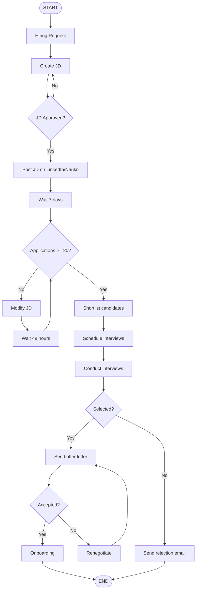
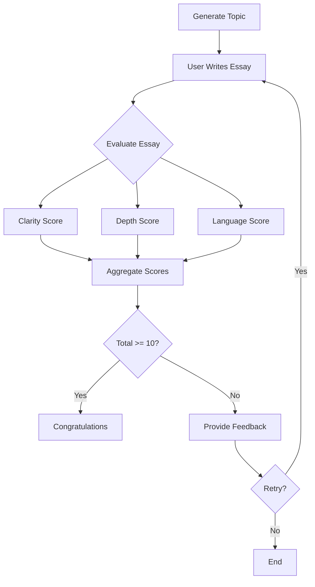

# [Agentic AI using LangGraph](https://chat.deepseek.com/share/m1qobvkz31i2sr1zzp)

## 01. Agentic AI using LangGraph (16:57)

## Vision & Goals

**Three Goals:**

1. **Simple & Beginner-friendly** - Anyone can learn to build agentic applications easily
2. **Strong command over LangGraph** - Deep fundamentals coverage
3. **Conceptual depth** - If LangGraph gets replaced, you can learn new frameworks easily

---

## Curriculum (6 Modules)

| Module | Topic | What You'll Learn |
|--------|-------|-------------------|
| **1** | Foundations of Agentic AI | Agentic AI vs AI Agents vs Generative AI, Agentic RAG vs Traditional RAG, Top frameworks |
| **2** | LangGraph Fundamentals | Graph building, State concept, Nodes, Edges, Conditional edges, Looping, Popular AI workflows |
| **3** | Advanced LangGraph | Persistence, Memory, Human-in-the-loop, Breakpoints, Checkpointers, Time travel |
| **4** | AI Agents Building | ReAct Agent, Reflection pattern, Self-ASK pattern, Planning, Multi-agent systems |
| **5** | Agentic RAG Applications | Self-RAG, Corrective RAG (CRAG), Advanced RAG architectures |
| **6** | Production | UI, Debugging, Observability, LangSmith integration, Deployment |

**Total videos:** Estimated 35-50 videos

**Upload frequency:** 3 videos per week (target)

---

## Prerequisites

| # | Requirement | Level |
|---|-------------|-------|
| 1 | **Python** | Intermediate (OOP, Typing module, Pydantic, Asyncio IO) |
| 2 | **LLMs** | Familiarity with working on LLMs |
| 3 | **LangChain** | Required - LangGraph is built on LangChain |

> ⚠️ Highly recommended to watch his LangChain playlist (18 videos) first.

---

## Important Concepts with Basic Code Examples

### 1. What is Agentic AI?

**Simple definition:** AI systems that can act autonomously, make decisions, and perform tasks without human intervention.

```python
# Simple concept: An agent that decides which tool to use
class SimpleAgent:
    def __init__(self, task):
        self.task = task
    
    def decide_action(self):
        if "calculate" in self.task:
            return "use_calculator"
        elif "search" in self.task:
            return "use_search"
        else:
            return "use_llm"
```

### 2. LangGraph - Graph, Nodes, Edges, State

**Node** = A step/function that processes information
**Edge** = Connection between nodes (where to go next)
**State** = Shared data container that passes between nodes

```python
from typing import TypedDict

# 1. Define State (shared data)
class AgentState(TypedDict):
    messages: list
    current_step: str

# 2. Define Nodes (functions)
def process_node(state: AgentState):
    state["messages"].append("Processing...")
    state["current_step"] = "done"
    return state

def validate_node(state: AgentState):
    if "error" in state["messages"]:
        return "error_handler"
    return "success"

# 3. Graph structure concept
"""
    START → process_node → validate_node → 
        ├─ (if error) → error_handler → END
        └─ (if success) → END
"""
```

### 3. Conditional Edges

Routing to different nodes based on conditions:

```python
# Conditional edge logic
def route_condition(state: AgentState) -> str:
    if state["current_step"] == "complete":
        return "end_node"
    elif state["needs_more_info"]:
        return "retrieval_node"
    else:
        return "processing_node"

# Usage: After a node, based on condition, go to different nodes
```

### 4. Looping in LangGraph

Repeating nodes until a condition is met:

```python
# Loop concept - iterative refinement
class LoopExample:
    def __init__(self, max_iterations=5):
        self.max_iterations = max_iterations
        self.iteration = 0
    
    def should_continue(self, state):
        if self.iteration >= self.max_iterations:
            return "end"
        if state["answer_quality"] > 0.9:
            return "end"
        self.iteration += 1
        return "continue"  # Goes back to processing node
```

### 5. AI Agent Design Patterns

**ReAct Pattern (Reason + Act):**

```python
# ReAct agent concept
class ReActAgent:
    def run(self, question):
        # 1. REASON - Think about what to do
        thought = self.think(question)
        
        # 2. ACT - Take action using a tool
        if thought["action"] == "search":
            result = self.search(thought["query"])
        elif thought["action"] == "calculate":
            result = self.calculate(thought["query"])
        
        # 3. OBSERVE - Get result and decide next
        observation = self.observe(result)
        
        # Loop until final answer
        return self.generate_answer(observation)
```

**Reflection Pattern:**

```python
# Agent reflects on its own output
class ReflectionAgent:
    def generate_response(self, query):
        # First attempt
        draft = self.llm.generate(query)
        
        # Reflect on the draft
        reflection = self.llm.reflect(f"Is this good? {draft}")
        
        # Improve based on reflection
        if reflection["needs_improvement"]:
            improved = self.llm.generate(f"Improve this: {draft}\nFeedback: {reflection}")
            return improved
        return draft
```

**Multi-Agent System:**

```python
# Multiple agents collaborating
class MultiAgentSystem:
    def __init__(self):
        self.researcher = ResearchAgent()
        self.writer = WriterAgent()
        self.reviewer = ReviewAgent()
    
    def work_together(self, topic):
        research = self.researcher.research(topic)
        draft = self.writer.write(research)
        feedback = self.reviewer.review(draft)
        
        if feedback["approved"]:
            return draft
        else:
            return self.writer.revise(draft, feedback)
```

### 6. Memory & Persistence

```python
# Checkpointer concept - saving state
class CheckpointExample:
    def save_state(self, state, checkpoint_id):
        # Save current execution state
        self.storage[checkpoint_id] = state.copy()
    
    def load_state(self, checkpoint_id):
        # Resume from saved state
        return self.storage[checkpoint_id]
    
    def time_travel(self, target_checkpoint):
        # Go back to any previous state
        return self.load_state(target_checkpoint)
```

### 7. Human-in-the-Loop

```python
class HumanInLoop:
    def run_with_approval(self, action):
        # Execute action
        result = self.execute(action)
        
        # Ask human for approval
        print(f"Action result: {result}")
        human_input = input("Approve? (y/n): ")
        
        if human_input == 'y':
            return self.continue_execution()
        else:
            return self.rollback_and_revise()
```

### 8. Agentic RAG (vs Traditional RAG)

**Traditional RAG:** Retrieve → Augment → Generate (one fixed path)
**Agentic RAG:** Agent decides WHEN and WHAT to retrieve

```python
# Traditional RAG
def traditional_rag(query):
    docs = vector_search(query)  # Always searches
    return llm.generate(query, docs)

# Agentic RAG
def agentic_rag(query, agent):
    # Agent decides if retrieval is needed
    decision = agent.decide(query)
    
    if decision == "need_retrieval":
        docs = vector_search(query)
        return llm.generate(query, docs)
    elif decision == "need_multiple_searches":
        docs1 = vector_search(query)
        docs2 = web_search(query)
        return llm.generate(query, docs1 + docs2)
    else:
        return llm.generate(query)  # No retrieval needed
```

### 9. Production Concepts

```python
# Basic observability setup
import logging
from langsmith import Client

class ProductionAgent:
    def __init__(self):
        self.logger = logging.getLogger("agent")
        self.langsmith = Client()
    
    def run_with_tracing(self, input_data):
        # Log every step
        self.logger.info(f"Starting with input: {input_data}")
        
        # Trace with LangSmith
        with self.langsmith.trace("agent_execution") as trace:
            result = self.process(input_data)
            trace.add_output(result)
        
        self.logger.info(f"Completed: {result}")
        return result
```

---

## Key Takeaways

1. **Start with prerequisites** - Intermediate Python + LLM familiarity + LangChain
2. **Don't skip fundamentals** - Module 1 & 2 are crucial
3. **Follow sequentially** - Each module builds on previous
4. **Expect changes** - This space evolves rapidly, curriculum will adapt
5. **Production focus** - Final module covers real-world deployment

---

## 02. Generative AI vs Agentic AI (01:02:43)

This lecture explains the key differences between Generative AI and Agentic AI by walking through a real-world **HR hiring scenario**. The instructor shows how a simple chatbot evolves through 4 stages to become a fully autonomous AI agent.

---

## Important Pointers

| # | Key Takeaway |
|---|--------------|
| 1 | **Generative AI** focuses on **creating content** (text, images, video, code, speech) |
| 2 | **Agentic AI** focuses on **achieving goals** autonomously through planning and action |
| 3 | GenAI is **reactive** → needs step-by-step human guidance |
| 4 | Agentic AI is **proactive** → given a goal, it plans and executes autonomously |
| 5 | Generative AI is a **building block** / subset of Agentic AI |
| 6 | Agentic AI combines: **Planning + Reasoning + Memory + Tools + LLMs** |
| 7 | Traditional AI learns patterns between input/output; GenAI learns the **distribution of data** |
| 8 | GenAI output feels like **human-created** content |

---

## What is Generative AI?

**Simple definition:** A class of AI models that can create **new content** (text, images, audio, code, video) that resembles human-created data.

**How it works (vs Traditional AI):**
- Traditional AI: Learns relationship between input → output (e.g., classify spam)
- GenAI: Learns the **entire distribution/nature of data** → can generate **new samples** from that distribution

**Example:** Give a GenAI model many cat images → it learns "what a cat looks like in real life" → then generates a brand new cat image.

```python
# Conceptual: Traditional AI vs Generative AI

# Traditional AI - Classification
def traditional_ai_classify(email):
    # Learns pattern: specific words -> spam or not
    if "lottery" in email or "prize" in email:
        return "spam"
    return "not_spam"

# Generative AI - Content creation
def generative_ai_generate(prompt):
    # Learns distribution of human language
    # Then generates NEW text that feels human-written
    return model.generate(prompt)  # "Write a poem about cats"
```

**Popular GenAI applications:**
- Chatbots: ChatGPT, Gemini, Claude, Grok
- Image generation: DALL-E, Midjourney
- Code generation: Code Llama
- Text-to-speech: Eleven Labs
- Video generation: Sora, Runway

---

## The Evolution: 4 Chatbot Stages in Hiring Scenario

**Problem:** You're an HR recruiter needing to hire a Backend Engineer (2-4 years experience). Tasks: draft JD → post on job portals → shortlist candidates → schedule interviews → send offer → onboard.

### Stage 1: Simple LLM Chatbot (Basic GenAI)

**How it works:** You ask, chatbot answers. Reactive, generic advice, no memory, no actions.

```python
class SimpleLLMChatbot:
    def ask(self, user_query):
        if "draft JD" in user_query:
            return "Here's a generic JD: Looking for backend engineer with Python..."
        elif "interview questions" in user_query:
            return "Ask about Python, frameworks, problem-solving..."
        else:
            return "I can help with basic HR tasks."
```

**Problems:**
- ❌ **Reactive** – waits for your prompt
- ❌ **No memory** – forgets previous conversations
- ❌ **Generic advice** – not company-specific
- ❌ **Cannot take actions** – can't post jobs or send emails

---

### Stage 2: RAG-Based Chatbot (Context-Aware)

**RAG = Retrieval Augmented Generation**

Adds company knowledge base (past JDs, hiring playbooks, salary bands, interview question bank, offer letter templates).

```python
# Simple RAG concept
class RAGChatbot:
    def __init__(self, company_knowledge_base):
        self.kb = company_knowledge_base  # past JDs, salary data, etc.
    
    def answer(self, query):
        # 1. RETRIEVE relevant company documents
        relevant_docs = self.kb.search(query)
        
        # 2. AUGMENT prompt with company context
        enhanced_prompt = f"Company context: {relevant_docs}\nUser query: {query}"
        
        # 3. GENERATE response
        return self.llm.generate(enhanced_prompt)

# Usage
kb = CompanyKB(jd_templates=[...], salary_bands=[...], interview_qs=[...])
bot = RAGChatbot(kb)
response = bot.answer("Draft JD for backend engineer")
# Returns: Tailored JD with company-specific tech stack (Python, Django) and salary band
```

**Improvements:**
- ✅ **Specific advice** – tailored to company DNA
- ✅ Uses past hiring data

**Remaining problems:**
- ❌ Still reactive
- ❌ No memory
- ❌ Cannot take actions

---

### Stage 3: Tool-Augmented Chatbot

Adds integrations with external tools via APIs: LinkedIn API, resume parser, calendar API, email API, HRM software.

```python
class ToolAugmentedChatbot:
    def __init__(self, tools):
        self.tools = tools  # e.g., linkedin_api, email_api, calendar_api
    
    def execute(self, user_command):
        if "post job on LinkedIn" in user_command:
            # Tool use: Actually posts the job
            return self.tools.linkedin_api.post_job(jd)
        elif "schedule interview" in user_command:
            # Tool use: Checks calendar and sends invites
            free_slots = self.tools.calendar_api.get_free_slots()
            self.tools.email_api.send_invite(candidate, free_slots[0])
            return "Interview scheduled"
        elif "shortlist candidates" in user_command:
            # Tool use: Downloads and parses resumes
            resumes = self.tools.linkedin_api.get_resumes()
            parsed = self.tools.resume_parser.parse(resumes)
            return self.rank_candidates(parsed)

# Example tools
class LinkedInAPI:
    def post_job(self, jd): return "Job posted"
    def boost_post(self, post_id): return "Post boosted"

class CalendarAPI:
    def get_free_slots(self): return ["Friday 10 AM", "Friday 2 PM"]

class EmailAPI:
    def send_email(self, to, subject, body): return "Email sent"
```

**Improvements:**
- ✅ Can **take actions** (post jobs, send emails, schedule interviews)
- ✅ Still has RAG (company-specific)

**Remaining problems:**
- ❌ Still reactive
- ❌ No memory / context awareness
- ❌ Cannot adapt when things go wrong (e.g., low applications)

---

### Stage 4: Agentic AI (The Goal)

**Definition:** An AI system that is **proactive, context-aware, and adaptable** – given a goal, it autonomously plans and executes steps, involving humans only for approval.

```python
# Simplified Agentic AI concept
class AgenticAI:
    def __init__(self, tools, knowledge_base, memory):
        self.tools = tools
        self.kb = knowledge_base
        self.memory = memory  # remembers past steps
        self.plans = []
    
    def run(self, goal):
        # 1. UNDERSTAND goal
        # 2. PLAN steps
        self.plans = self.create_plan(goal)
        # 3. EXECUTE each step autonomously
        for step in self.plans:
            result = self.execute_step(step)
            self.memory.remember(step, result)
            # 4. MONITOR and ADAPT if problems arise
            if self.has_problem(result):
                self.adapt_plan()
        return "Goal achieved"
    
    def create_plan(self, goal):
        # "Hire backend engineer" -> 
        # [draft_JD, post_JD, monitor_applications, shortlist, 
        #  schedule_interviews, conduct_interviews, send_offer, onboard]
        return self.llm.plan(goal, self.kb)
    
    def execute_step(self, step):
        if step == "post_JD":
            return self.tools.linkedin_api.post_job(self.jd)
        elif step == "monitor_applications":
            count = self.tools.linkedin_api.get_application_count()
            if count < 5:  # ADAPTATION
                self.suggest_boosting()
            return count
```

**Key capabilities demonstrated in the video:**

1. **Proactive** – After receiving "Hire a backend engineer", the agent automatically:
   - Drafts JD using company data
   - Posts to LinkedIn & Naukri
   - Monitors application counts
   - Notifies when applications are low
   - Suggests solutions (broaden JD, boost posts)
   - Gets human approval, then executes changes

2. **Context-aware (Memory)** – Remembers:
   - That it already drafted a JD
   - Which platforms it posted to
   - Which candidates were shortlisted
   - That interviews are scheduled for Friday

3. **Adaptable** – When only 2 applications came (below expectation), the agent:
   - Detected the problem autonomously
   - Suggested: "Broaden JD to include Full Stack" + "Boost LinkedIn post"
   - Waited for human approval, then executed both

4. **Tool usage** – Posts jobs, checks calendar, sends emails, parses resumes, triggers onboarding

5. **Human-in-the-loop** – Asks for approvals at key decision points, but does all heavy lifting

```python
# Practical example: Agentic hiring flow
class HiringAgent(AgenticAI):
    def run_hiring(self, role, experience_years):
        # Step 1: Draft JD
        jd = self.draft_jd(role, experience_years)
        self.request_approval("JD ready", jd)
        
        # Step 2: Post jobs
        self.post_to_platforms(jd, ["LinkedIn", "Naukri"])
        
        # Step 3: Monitor (proactive)
        while self.days_elapsed < 7:
            apps = self.check_applications()
            if apps < 5 and self.days_elapsed > 2:
                # Self-adaptation
                self.suggest_and_execute("Low applications. Boost posts?")
            time.sleep(86400)
        
        # Step 4: Auto-shortlist using resume parser
        candidates = self.parse_and_rank_resumes()
        self.notify_user(f"Top {len(candidates)} candidates identified")
        
        # Step 5: Auto-schedule interviews via calendar
        slots = self.get_free_slots()
        self.send_invites(candidates[:2], slots[0])
        
        # Step 6: After interview feedback, auto-send offer
        self.generate_and_send_offer(selected_candidate)
        
        # Step 7: Trigger onboarding
        self.trigger_onboarding(selected_candidate)
        return "Hiring complete"
```

---

## Final Comparison Table

| Feature | Generative AI | Agentic AI |
|---------|---------------|------------|
| **Primary focus** | Create content (text, images, etc.) | Achieve a goal |
| **Behavior** | Reactive – responds to prompts | Proactive – initiates actions |
| **Human involvement** | Guides every step | Only gives high-level goal + approvals |
| **Memory** | Typically none (stateless) | Has context memory |
| **Tool use** | No (can't act) | Yes (calls APIs, sends emails, etc.) |
| **Adaptability** | No | Yes – detects problems and adjusts plans |
| **Planning** | No | Yes – breaks goals into steps |
| **Example** | "Write a job description" | "Hire a backend engineer" → agent does everything |

---

## Key Quote from Video

> **"Generative AI is a capability, Agentic AI is a behavior."**

Agentic AI uses GenAI (LLMs) as its **brain** for reasoning and planning, but adds:
- Memory
- Tool use
- Planning & reasoning loops
- Adaptability
- Autonomy

---

## 03. What is Agentic AI? (01:00:24)

This lecture provides a **formal definition** of Agentic AI, its key characteristics, and how it differs from reactive systems like chatbots. The instructor uses the same HR hiring example from the previous video to illustrate each concept.

---

## Important Pointers

| # | Key Takeaway |
|---|--------------|
| 1 | **Agentic AI** = system that takes a goal from user and works toward completing it **autonomously** (minimal human guidance) |
| 2 | Agentic AI is **proactive**, not reactive – it initiates actions and plans on its own |
| 3 | 6 key characteristics: **Autonomy, Goal-Oriented, Planning, Reasoning, Adaptability, Context Awareness** |
| 4 | Autonomy can be **controlled** via permissions, human-in-the-loop, overrides, and guardrails |
| 5 | Planning = breaking a high-level goal into structured sequence of sub-goals |
| 6 | Planning involves: generate multiple candidate plans → evaluate → select best |
| 7 | Reasoning is needed in **both planning and execution** stages |
| 8 | Adaptability = ability to modify plans when unexpected conditions occur |
| 9 | Context awareness = retaining and utilizing information from ongoing tasks, past interactions, environment |
| 10 | Two types of memory: **Short-term** (current session) and **Long-term** (persistent rules/preferences) |

---

## What is Agentic AI? (Simple Definition)

> **Agentic AI** is a type of AI that takes a task/goal from a user and then works toward completing it on its own, with minimal human guidance. It plans, takes actions, adapts to changes, and seeks help only when necessary.

**Contrast with Generative AI (ChatGPT-style):**
- **Reactive:** You ask a question → chatbot answers. You guide every step.
- **Agentic:** You give a goal ("Plan my Goa trip") → agent autonomously figures out dates, transport, hotels, itinerary, and presents complete plan.

---

## The HR Hiring Example (Brief)

**Goal given to Agentic AI:** "Hire a remote backend engineer with 2-4 years experience"

The agent autonomously:
1. Drafts job description using company docs
2. Posts to LinkedIn & Naukri via APIs
3. Monitors applications daily
4. Detects low applications → suggests solutions (broaden JD, boost ads) → gets approval → executes
5. Shortlists candidates using resume parser
6. Checks calendar & schedules interviews
7. Sends offer letter and triggers onboarding

**Human only gives approval at key decision points.**

---

## 6 Key Characteristics of Agentic AI Systems

### 1. Autonomy

**Definition:** Ability to make decisions and take actions on its own to achieve a goal, without step-by-step human instructions.

```python
# Reactive chatbot (NOT autonomous)
def reactive_chatbot():
    while True:
        user_input = input("What do you need? ")
        if "draft JD" in user_input:
            print(draft_jd())
        elif "post job" in user_input:
            print("You need to post it manually")

# Agentic AI (autonomous)
class AutonomousAgent:
    def __init__(self, goal):
        self.goal = goal
        self.plan = []
    
    def run(self):
        # Autonomously plans and executes
        self.plan = self.create_plan(self.goal)
        for step in self.plan:
            self.execute_step(step)  # No human asking each time
        return "Goal achieved"
```

**Controlling Autonomy (Important!):**
- **Limit tools/actions** – restrict what agent can do independently
- **Human-in-the-loop** – require approval before critical actions
- **Override controls** – pause/stop agent anytime
- **Guardrails** – hard rules (e.g., "never schedule weekends")

```python
class ControlledAgent:
    def execute_with_approval(self, action, critical=False):
        if critical:
            approval = input(f"Approve {action}? (y/n): ")
            if approval != 'y':
                return "Action blocked"
        return self.do(action)
    
    # Guardrail: hard-coded rule
    def schedule_interview(self, date):
        if date.weekday() >= 5:  # Saturday or Sunday
            raise ValueError("Weekend interviews not allowed")
        return self.calendar.schedule(date)
```

---

### 2. Goal-Oriented

**Definition:** Operates with a persistent objective in mind and continuously directs actions to achieve that objective, rather than just responding to isolated prompts.

```python
class GoalOrientedAgent:
    def __init__(self):
        self.goal = None
        self.progress = {}
    
    def set_goal(self, goal_description, constraints=None):
        self.goal = {
            "main_goal": goal_description,
            "constraints": constraints or [],
            "status": "active",
            "created_at": timestamp(),
            "progress": {
                "completed_tasks": [],
                "pending_tasks": []
            }
        }
    
    def check_progress(self):
        # Returns: "JD drafted", "Posted on LinkedIn", etc.
        return self.goal["progress"]
    
    def is_goal_complete(self):
        return self.goal["status"] == "completed"

# Example goal structure (JSON-like)
goal = {
    "main_goal": "Hire a backend engineer",
    "constraints": [
        "2-4 years experience",
        "Remote only",
        "Budget under $5000"
    ],
    "status": "active",
    "progress": {
        "JD drafted": True,
        "Posted on LinkedIn": True,
        "Applications received": 8,
        "Interviews scheduled": 2
    }
}
```

**Goals can be altered mid-way** – agent re-plans automatically.

---

### 3. Planning

**Definition:** Ability to break down a high-level goal into a structured sequence of actions and sub-goals.

**The 3-step planning process:**

```python
class PlanningAgent:
    def plan(self, goal):
        # STEP 1: Generate multiple candidate plans
        candidate_plans = [
            ["draft_JD", "post_on_LinkedIn", "monitor", "shortlist", "interview", "offer"],
            ["draft_JD", "use_referral_program", "hire_agency", "interview"],
            ["find_freelancer", "negotiate", "onboard"]
        ]
        
        # STEP 2: Evaluate each plan
        evaluated_plans = []
        for plan in candidate_plans:
            score = self.evaluate_plan(plan, criteria=[
                "efficiency",      # How fast?
                "tool_availability", # Do we have required APIs?
                "cost",            # Within budget?
                "risk",            # Likelihood of failure?
                "constraint_alignment" # Remote-only? etc.
            ])
            evaluated_plans.append((plan, score))
        
        # STEP 3: Select the best plan
        best_plan = max(evaluated_plans, key=lambda x: x[1])
        return best_plan[0]
    
    def execute_plan(self, plan):
        # Executes iteratively – can re-plan if a step fails
        for step in plan:
            success = self.execute_step(step)
            if not success:
                return self.replan_and_continue(step)
        return "Plan completed"
```

**Key insight:** Planning is an **iterative loop** – if execution fails at step 4, agent goes back to planning stage and creates a new plan.

---

### 4. Reasoning

**Definition:** The cognitive process through which an agent interprets information, draws conclusions, and makes decisions (during both planning and execution).

```python
class ReasoningAgent:
    def reason_about_planning(self, goal):
        # Goal decomposition reasoning
        if "hire" in goal:
            # Reason: Hiring requires JD, posting, screening, etc.
            return ["draft_JD", "post_job", "screen_candidates"]
        
        # Tool selection reasoning
        if step == "find_salary_range":
            # Reason: I need external data → use search tool
            return self.tools.search
        
        # Resource estimation reasoning
        if complexity == "high":
            return {"estimated_days": 7, "risks": ["low applications"]}
    
    def reason_during_execution(self, observation):
        # Decision making: which candidate to shortlist?
        if observation["match_score"] > 0.8:
            return "shortlist"
        elif observation["match_score"] > 0.5:
            return "maybe_ask_human"
        else:
            return "reject"
        
        # Human-in-the-loop reasoning
        if self.confidence < 0.6:
            return self.ask_human_for_help()
        
        # Error handling reasoning
        if self.tool_available(api_name) == False:
            # Reason: Tool down → find alternative
            return self.find_alternative_tool()
```

**Example from video:** Agent notices low applications (observation) → reasons that JD might be too narrow or post not promoted → decides to suggest broadening JD and boosting ads.

---

### 5. Adaptability

**Definition:** Ability to modify plans, strategies, and actions in response to unexpected conditions, while staying aligned with the goal.

```python
class AdaptableAgent:
    def execute_with_adaptation(self, plan):
        for step in plan:
            try:
                result = self.execute_step(step)
                self.monitor(result)
            except ToolFailureError:
                # ADAPT: Tool failed
                self.adapt_to_tool_failure(step)
            except ExternalFeedback as feedback:
                # ADAPT: Environment says something's wrong
                if feedback.low_applications:
                    self.adapt_strategy({"broaden_JD": True, "boost_ads": True})
            except GoalChangedError:
                # ADAPT: Goal changed mid-way
                return self.replan_with_new_goal()
    
    def adapt_to_tool_failure(self, failed_step):
        # Example: Calendar API down
        if failed_step.tool == "calendar_api":
            # Instead of failing, ask human directly
            availability = self.ask_human("When are you free?")
            return self.schedule_manually(availability)
    
    def adapt_strategy(self, changes):
        # Example: Low applications
        if changes.get("broaden_JD"):
            self.jd["title"] = "Backend/Full Stack Engineer"
            self.repost_job()
        if changes.get("boost_ads"):
            self.linkedin_api.boost_post(self.job_id, budget=100)
```

**Three triggers for adaptation:**
1. **Tool failures** – API down, timeout, etc.
2. **External feedback** – low applications, candidate rejection
3. **Goal changes** – user changes requirements mid-process

---

### 6. Context Awareness

**Definition:** Ability to understand, retain, and utilize relevant information from ongoing tasks, past interactions, user preferences, and environmental cues.

```python
class ContextAwareAgent:
    def __init__(self):
        self.short_term_memory = {}   # Current session
        self.long_term_memory = {}    # Persistent rules/preferences
    
    def store_context(self, key, value, persistent=False):
        if persistent:
            self.long_term_memory[key] = value
        else:
            self.short_term_memory[key] = value
    
    def get_context(self, key):
        # Check short-term first, then long-term
        if key in self.short_term_memory:
            return self.short_term_memory[key]
        return self.long_term_memory.get(key)
    
    def run_hiring(self):
        # Stores original goal
        self.store_context("goal", "Hire backend engineer", persistent=True)
        
        # Stores progress
        self.store_context("progress", {"JD_drafted": True, "posted": False})
        
        # Stores environment state
        self.store_context("environment", {
            "linkedin_job_id": "12345",
            "applications_received": 8,
            "ad_budget_remaining": 50
        })
        
        # Stores tool responses
        resume_data = self.resume_parser.parse(candidate_resume)
        self.store_context(f"candidate_{id}", resume_data)
        
        # Stores user preferences (persistent)
        self.store_context("prefers_remote", True, persistent=True)
        self.store_context("max_budget", 5000, persistent=True)
        
        # Stores guardrails (persistent)
        self.store_context("guardrail", "no_offer_without_approval", persistent=True)
```

**Types of Context Stored:**

| Context Type | Example | Memory Type |
|--------------|---------|-------------|
| Original goal | "Hire backend engineer" | Long-term |
| Progress | JD drafted, 8 applications | Short-term |
| Environment | LinkedIn job ID, ad budget | Short-term |
| Tool responses | "Candidate has 3 years Django" | Short-term |
| User preferences | Remote-only, budget limit | Long-term |
| Guardrails | "No offers without approval" | Long-term |

---

## Two Types of Memory in Agentic AI

```python
class AgentMemory:
    def __init__(self):
        # Short-term: current session only
        self.short_term = {
            "current_goal": "Hire backend engineer",
            "completed_steps": ["draft_JD", "post_on_LinkedIn"],
            "tool_responses": {"resume_parser": "candidate_A_score: 0.9"}
        }
        
        # Long-term: persists across sessions
        self.long_term = {
            "user_preferences": {"remote_only": True, "max_budget": 5000},
            "guardrails": ["no_weekend_interviews", "approval_required_for_offer"],
            "company_policies": {"salary_band_2_4_years": "8-12 LPA"}
        }
    
    def recall(self):
        # Agent uses both to make decisions
        if self.long_term["guardrails"]["no_weekend_interviews"]:
            self.schedule_filter.avoid_weekends()
        
        if self.short_term["completed_steps"]:
            next_step = self.get_next_step()
            return next_step
```

---

## Summary Table: Agentic AI vs Generative AI (Chatbots)

| Feature | Generative AI (ChatGPT) | Agentic AI |
|---------|------------------------|-------------|
| **Interaction style** | Reactive – responds to prompts | Proactive – initiates actions |
| **Human involvement** | Guides every step | Only gives goal + occasional approvals |
| **Memory** | None (stateless) | Short-term + long-term memory |
| **Planning** | No | Yes – breaks goals into steps |
| **Reasoning** | Limited | Extensive (planning + execution) |
| **Tool use** | No | Yes (APIs, search, calendar, email) |
| **Adaptability** | No | Yes – handles failures and changes |
| **Example** | "Write a JD" | "Hire a backend engineer" → agent does everything |

---

## Key Pointers

> **"Autonomy + Goal Orientation + Planning + Reasoning + Adaptability + Context Awareness = Agentic AI"**

Generative AI is a **capability** (content creation). Agentic AI is a **behavior** (autonomous goal achievement). Agentic AI uses GenAI (LLMs) as its brain for reasoning and planning, but adds memory, tools, and adaptability.

---

This section covers the **5 core components** found in almost every Agentic AI application. The instructor explains each component's role and how they work together.

## Important Pointers

| # | Component | Role |
|---|-----------|------|
| 1 | **Brain** | The LLM – interprets goals, plans, reasons, selects tools, communicates |
| 2 | **Orchestrator** | Executes the plan – sequences tasks, conditional routing, retries, looping, delegation |
| 3 | **Tools** | Hands and legs of the agent – interact with external world (APIs, databases, email, search, RAG) |
| 4 | **Memory** | Stores short-term (session) and long-term (persistent) information, tracks state |
| 5 | **Supervisor** | Implements human-in-the-loop – approvals, guardrails, escalations |

---

## 1. Brain (The LLM)

**Definition:** The core intelligence – typically an LLM (Large Language Model) that handles all heavy cognitive lifting.

**What the Brain does:**
- **Goal interpretation** – understands what user actually wants
- **Planning** – breaks goals into sub-goals
- **Reasoning** – during both planning and execution
- **Tool selection** – decides which tool to use for which task
- **Communication** – generates natural language for human interaction

```python
# Simple Brain implementation using an LLM
class AgentBrain:
    def __init__(self, llm):
        self.llm = llm  # e.g., GPT-4, Claude, Gemini
    
    def interpret_goal(self, user_input):
        prompt = f"Interpret this goal and extract key requirements: {user_input}"
        return self.llm.generate(prompt)
        # Example output: {"action": "hire", "role": "backend engineer", 
        #                  "experience": "2-4 years", "remote": True}
    
    def plan(self, goal):
        prompt = f"Break this goal into a sequence of steps: {goal}"
        return self.llm.generate(prompt).split("\n")
        # Example output: ["draft_JD", "post_on_LinkedIn", "shortlist", "interview", "send_offer"]
    
    def reason(self, observation, context):
        prompt = f"Given {observation} and context {context}, what should I do next?"
        return self.llm.generate(prompt)
    
    def select_tool(self, task):
        prompt = f"Which tool is best for: {task}? Available tools: search, email, calendar, resume_parser"
        return self.llm.generate(prompt).strip()  # Returns tool name
    
    def communicate(self, message, user_type="human"):
        # Generates human-friendly response
        return self.llm.generate(f"Respond politely to user: {message}")
```

---

## 2. Orchestrator

**Definition:** The "project manager" or "nervous system" – executes the plan step by step, handling sequencing, routing, retries, loops, and delegation.

**What the Orchestrator does:**
- **Task sequencing** – decides order of execution
- **Conditional routing** – based on previous step output, chooses next step
- **Retry logic** – if a tool fails, retries or finds alternative
- **Looping/iteration** – repeats steps when needed
- **Delegation** – decides when to ask human vs LLM vs tool

```python
class Orchestrator:
    def __init__(self, brain, tools, memory, supervisor):
        self.brain = brain
        self.tools = tools
        self.memory = memory
        self.supervisor = supervisor
    
    def execute_plan(self, plan):
        """Executes plan with conditional routing, retries, loops"""
        step_index = 0
        while step_index < len(plan):
            step = plan[step_index]
            
            # Conditional routing based on previous result
            if step == "post_on_LinkedIn" and self.memory.get("jd_drafted") == False:
                step_index += 1  # Skip if JD not ready
                continue
            
            # Retry logic
            for attempt in range(3):
                try:
                    result = self.execute_step(step)
                    break  # Success, exit retry loop
                except ToolFailureError:
                    if attempt == 2:
                        # After 3 failures, ask human
                        result = self.supervisor.escalate(f"Step {step} failed after 3 attempts")
            
            # Store result in memory
            self.memory.store(f"step_{step}_result", result)
            
            # Conditional routing based on result
            if step == "shortlist" and result["strong_candidates"] == 0:
                step_index = plan.index("broaden_JD")  # Jump to adaptation step
                continue
            
            # Looping - repeat interview step for each candidate
            if step == "interview" and result["more_candidates"]:
                # Don't increment step_index – repeat this step
                continue
            
            step_index += 1
    
    def execute_step(self, step):
        # Delegate to appropriate executor
        if step in ["draft_JD", "plan"]:
            return self.brain.plan(step)  # Brain handles cognitive steps
        elif step in ["post_job", "send_email", "check_calendar"]:
            return self.tools.use(step)   # Tools handle actions
        elif step in ["approve_offer"]:
            return self.supervisor.request_approval(step)  # Supervisor handles human
        else:
            return self.default_execute(step)
```

---

## 3. Tools (Hands and Legs)

**Definition:** Components that allow the agent to interact with the external world – APIs, databases, search engines, email, calendar, RAG knowledge bases.

```python
class ToolBox:
    def __init__(self):
        self.tools = {
            "linkedin_api": LinkedInAPI(),
            "resume_parser": ResumeParser(),
            "calendar_api": CalendarAPI(),
            "email_api": EmailAPI(),
            "search": SearchTool(),
            "rag_knowledge_base": RAGKnowledgeBase()  # Company documents
        }
    
    def use(self, tool_name, params):
        if tool_name not in self.tools:
            raise ToolNotFoundError(f"{tool_name} not available")
        return self.tools[tool_name].execute(params)

# Example tool implementations
class LinkedInAPI:
    def execute(self, params):
        if params["action"] == "post_job":
            return self.post_job(params["jd"])
        elif params["action"] == "boost_post":
            return self.boost_ad(params["job_id"], params["budget"])
        elif params["action"] == "get_applications":
            return self.fetch_applications(params["job_id"])
        return {"status": "success"}

class ResumeParser:
    def execute(self, params):
        resume_text = self.extract_text(params["resume_pdf"])
        return {
            "skills": ["Python", "Django", "AWS"],
            "experience_years": 3.5,
            "education": "B.Tech CS",
            "match_score": 0.85
        }

class CalendarAPI:
    def execute(self, params):
        if params["action"] == "get_free_slots":
            return ["2024-01-15 10:00", "2024-01-15 14:00"]
        elif params["action"] == "schedule":
            return {"meeting_id": "abc123", "status": "scheduled"}

class RAGKnowledgeBase:
    """Retrieves company-specific information"""
    def __init__(self, vector_db, company_docs):
        self.vector_db = vector_db
        self.docs = company_docs  # Past JDs, salary bands, policies
    
    def execute(self, params):
        query = params["query"]
        relevant_docs = self.vector_db.search(query, top_k=3)
        return {"retrieved_docs": relevant_docs}

# Using tools in agent
tools = ToolBox()
result = tools.use("linkedin_api", {"action": "post_job", "jd": jd_text})
result = tools.use("resume_parser", {"resume_pdf": candidate_resume})
result = tools.use("calendar_api", {"action": "get_free_slots"})
```

---

## 4. Memory

**Definition:** Stores information across the agent's lifespan – both short-term (current session) and long-term (persistent across sessions).

**Two types of memory:**

| Type | Stores | Persistence | Example |
|------|--------|-------------|---------|
| **Short-term** | Current session messages, tool call results, immediate decisions | Session only | "User asked for JD at 10:00 AM", "LinkedIn post ID = 12345" |
| **Long-term** | High-level goals, past interactions, user preferences, policies, guardrails | Across sessions | "Company prefers remote candidates", "Budget = $5000" |

```python
class AgentMemory:
    def __init__(self):
        self.short_term = {
            "session_id": "abc-123",
            "messages": [],           # Conversation history
            "tool_responses": {},     # Results from tool calls
            "current_step": "draft_JD",
            "progress": {
                "jd_drafted": True,
                "job_posted": False,
                "applications": 0
            }
        }
        
        self.long_term = {
            "user_preferences": {
                "remote_only": True,
                "preferred_platforms": ["LinkedIn", "Naukri"],
                "max_budget": 5000
            },
            "company_policies": {
                "salary_band_2_4_years": "8-12 LPA",
                "no_weekend_interviews": True,
                "required_tech_stack": ["Python", "Django", "AWS"]
            },
            "past_hiring_data": {
                "successful_sources": ["LinkedIn", "Referrals"],
                "avg_time_to_hire": 14  # days
            },
            "guardrails": [
                "never_send_offer_without_approval",
                "never_exceed_budget"
            ]
        }
    
    def store(self, key, value, persistent=False):
        if persistent:
            self.long_term[key] = value
        else:
            self.short_term[key] = value
    
    def recall(self, key):
        # Check short-term first, then long-term
        if key in self.short_term:
            return self.short_term[key]
        return self.long_term.get(key, None)
    
    def update_progress(self, task, status):
        self.short_term["progress"][task] = status
    
    def get_context_prompt(self):
        """Generate context for LLM from memory"""
        return f"""
        Current progress: {self.short_term['progress']}
        User preferences: {self.long_term['user_preferences']}
        Guardrails: {self.long_term['guardrails']}
        Previous conversation: {self.short_term['messages'][-5:]}
        """
```

---

## 5. Supervisor (Human-in-the-Loop)

**Definition:** Component that enables collaboration between the agent and humans – handles approvals, guardrails, and escalations.

```python
class Supervisor:
    def __init__(self, notification_channel="email", human_contact="hr@company.com"):
        self.notification_channel = notification_channel
        self.human_contact = human_contact
    
    def request_approval(self, action, details):
        """Ask human before executing high-risk actions"""
        print(f"Approval required for: {action}")
        print(f"Details: {details}")
        
        if self.notification_channel == "email":
            self.send_approval_email(action, details)
        
        user_input = input(f"Approve {action}? (y/n/explain): ")
        if user_input.lower() == 'y':
            return {"status": "approved", "action": action}
        elif user_input.lower() == 'n':
            return {"status": "rejected", "action": action}
        else:
            # Human gave explanation – agent should adapt
            return {"status": "needs_modification", "feedback": user_input}
    
    def enforce_guardrail(self, proposed_action, context):
        """Check if action violates any guardrail"""
        guardrails = context["long_term_memory"].get("guardrails", [])
        
        for rule in guardrails:
            if rule == "never_send_offer_without_approval" and proposed_action == "send_offer":
                return self.request_approval("send_offer", context)
            
            if rule == "never_exceed_budget" and proposed_action == "boost_ads":
                current_spend = context["short_term_memory"].get("ad_spend", 0)
                if current_spend + context["proposed_budget"] > context["budget_limit"]:
                    return self.request_approval("increase_budget", {"current": current_spend, "proposed": context["proposed_budget"]})
        
        return {"status": "allowed", "action": proposed_action}
    
    def escalate(self, issue, context):
        """For edge cases – alert human with recommendation"""
        message = f"""
        ALERT: Agent encountered an issue that requires human attention.
        
        Issue: {issue}
        Current context: {context}
        
        Suggested action: Please review manually.
        """
        self.send_notification(message)
        
        # Wait for human response (in real system, this would be async)
        return self.wait_for_human_response()
    
    def handle_edge_case(self, candidate, context):
        """Example: Candidate from non-IIT/NIT but excellent profile"""
        if candidate["college"] not in ["IIT", "NIT"] and candidate["match_score"] > 0.9:
            return self.escalate(
                "Strong candidate from non-premier institute",
                {"candidate": candidate, "recommendation": "Consider bypassing institute filter"}
            )
        return {"decision": "auto_process"}
```

---

## Complete Agentic AI System – All Components Together

```python
class CompleteAgenticAISystem:
    def __init__(self, llm_model, tools, memory, supervisor):
        self.brain = AgentBrain(llm_model)
        self.orchestrator = Orchestrator(self.brain, tools, memory, supervisor)
        self.tools = tools
        self.memory = memory
        self.supervisor = supervisor
    
    def run(self, user_goal):
        # 1. Brain interprets goal
        interpreted_goal = self.brain.interpret_goal(user_goal)
        self.memory.store("goal", interpreted_goal, persistent=True)
        
        # 2. Brain creates plan (multiple candidate plans, then selects best)
        candidate_plans = self.brain.generate_candidate_plans(interpreted_goal)
        best_plan = self.evaluate_and_select_plan(candidate_plans)
        self.memory.store("current_plan", best_plan)
        
        # 3. Orchestrator executes plan step by step
        final_result = self.orchestrator.execute_plan(best_plan)
        
        # 4. Supervisor handles any approvals needed during execution
        #    (already embedded in orchestrator)
        
        return final_result

# Usage example
system = CompleteAgenticAISystem(
    llm_model=GPT4(),
    tools=ToolBox(),
    memory=AgentMemory(),
    supervisor=Supervisor()
)

result = system.run("Hire a remote backend engineer with 2-4 years experience")
print(result)  # "Successfully hired candidate. Onboarding triggered."
```

---

## Summary Table: 5 Components

| Component | Role | Example |
|-----------|------|---------|
| **Brain (LLM)** | Intelligence – plans, reasons, selects tools | GPT-4, Claude, Gemini |
| **Orchestrator** | Execution manager – sequences, routes, retries | LangGraph, CrewAI, AutoGen |
| **Tools** | External actions – APIs, search, RAG, email | LinkedIn API, Resume parser, Calendar |
| **Memory** | Storage – short-term & long-term state | Conversation history, user preferences |
| **Supervisor** | Human collaboration – approvals, guardrails, escalations | Approval requests, budget checks |

---

## Key Takeaway

> **Agentic AI = Brain (LLM) + Orchestrator (Framework) + Tools (APIs) + Memory (State) + Supervisor (Human-in-Loop)**

> All five components work together to create a system that is **autonomous, goal-oriented, planning, reasoning, adaptable, and context-aware**.

### Key Characteristics of AI Agent :-
- Autonomus
- Goal Oriented
- Planning
- Reasoning
- Adaptability
- Context Awarness

### Key Components of AI Agent :-
- Brain
- Orchestrator
- Tools
- Memory
- Supervisor

---

## 04. LangChain Vs LangGraph (01:27:28)

This lecture explains **why LangGraph was created** by comparing it with LangChain. It uses an **automated hiring workflow** (from the previous video) to show that LangChain works well for **linear workflows** but struggles with **non‑linear workflows** (loops, conditionals, jumps). LangGraph solves this by representing every workflow as a **graph** – nodes (tasks) and edges (control flow) – eliminating the need for messy “glue code”.

---

## 📌 Important Pointers

| # | Key Point |
|---|------------|
| 1 | **LangChain** = open‑source library for building LLM‑based apps. Great for **linear chains** (step A → B → C). |
| 2 | **LangChain components**: Models (unified LLM interface), Prompts, Retrievers (RAG), Chains (sequence of components). |
| 3 | **Automated hiring workflow** (from earlier video) is **non‑linear**: has conditional branches, loops, and jumps. |
| 4 | Implementing this in **LangChain** requires writing custom Python `while` loops, `if‑else`, etc. – this extra code is called **glue code**. |
| 5 | Glue code makes the codebase **hard to maintain, debug, and scale** – especially in teams. |
| 6 | **LangGraph** represents every workflow as a **graph**: nodes = tasks (Python functions), edges = control flow. |
| 7 | LangGraph provides **built‑in constructs** for conditional edges, loops, and jumps – **no glue code** needed. |
| 8 | LangGraph is built by the LangChain team and is one of the top frameworks for **agentic AI** (along with CrewAI, AutoGen). |

---

## 1. Quick Recap: What is LangChain?

**Definition:** LangChain is an open‑source library that simplifies building applications powered by LLMs (Large Language Models).

**Core building blocks (components):**

| Component | Purpose |
|-----------|---------|
| **Models** | Unified interface to talk to any LLM (OpenAI, Anthropic, Hugging Face, Ollama, etc.) |
| **Prompts** | Help with prompt engineering (templates, few‑shot examples) |
| **Retrievers** | Fetch relevant documents from vector stores / knowledge bases (for RAG) |
| **Chains** | Combine components in sequence – output of one becomes input of the next. **This is LangChain’s flagship feature.** |

**What you can build with LangChain:**
- Simple conversational chatbots
- Text summarizers
- Multi‑step workflows (e.g., generate a detailed report, then summarise it)
- RAG applications (chat with your documents)
- **Basic agents** (LLM + tools, e.g., weather API)

**Simple linear chain example (LangChain):**

```python
from langchain.chat_models import ChatOpenAI
from langchain.prompts import ChatPromptTemplate
from langchain.schema.output_parser import StrOutputParser

llm = ChatOpenAI(model="gpt-4", temperature=0)

# Chain 1: Generate a report
report_prompt = ChatPromptTemplate.from_template(
    "Write a detailed report about: {topic}"
)
report_chain = report_prompt | llm | StrOutputParser()

# Chain 2: Summarise the report
summary_prompt = ChatPromptTemplate.from_template(
    "Summarise this report in 3 bullet points:\n{report}"
)
summary_chain = summary_prompt | llm | StrOutputParser()

# Combined chain (linear)
full_chain = report_chain | summary_chain

result = full_chain.invoke({"topic": "remote work trends"})
print(result)
```

**Note:** This is linear – A → B → C. No loops, no conditionals.

---

## 2. The Automated Hiring Workflow (Non‑Linear)

This is the workflow from the previous video (simplified here):



**Why this is non‑linear:**
- **Conditional branches** – “JD Approved?” (yes/no), “Applications >= 20?” etc.
- **Loops** – “JD not approved → go back to Create JD”, “Low applications → modify JD → wait → re‑check”
- **Jumps** – after modifying JD, jump back to the monitoring step.

---

## 3. Trying to Implement This in LangChain – The Problem

LangChain’s native construct is the **linear chain**. To implement loops or conditionals, you have to write **plain Python** around the chains. That extra code is called **glue code**.

**Example: implementing only the JD approval loop in LangChain**

```python
from langchain.chat_models import ChatOpenAI
from langchain.prompts import ChatPromptTemplate
from langchain.schema.output_parser import StrOutputParser

llm = ChatOpenAI(model="gpt-4", temperature=0)

# Helper functions (glue code starts here)
def create_jd(prompt_text):
    jd_prompt = ChatPromptTemplate.from_template(
        "Create a job description for: {request}"
    )
    chain = jd_prompt | llm | StrOutputParser()
    return chain.invoke({"request": prompt_text})

def approve_jd(jd_text):
    # Dummy approval logic – in reality, ask a human
    return "engineer" in jd_text.lower()

def post_jd(jd_text):
    print("Posting JD to LinkedIn...")
    # API call would go here

# Main workflow with loop (glue code continues)
hiring_prompt = "Need a backend engineer, remote, 2-4 years exp."

approved = False
jd = None
while not approved:
    jd = create_jd(hiring_prompt)
    print("\nGenerated JD:\n", jd)
    approved = approve_jd(jd)
    if not approved:
        print("JD not approved. Regenerating...\n")

post_jd(jd)
```

**Problems with this approach:**
- The `while` loop and `if` conditions are **hand‑written Python**, not LangChain abstractions.
- As the workflow grows (multiple loops, branches, nested conditions), the glue code becomes a **spaghetti** of custom logic.
- Hard to **debug** (errors can be anywhere in the Python code).
- Hard to **maintain** (changing one step may break manual loop indexes).
- **Not scalable** for complex agentic workflows.

> **Glue code = any code you write to stitch together library components that the library itself doesn’t provide. Less glue code = better maintainability.**

---

## 4. LangGraph – Workflow as a Graph

LangGraph (by the LangChain team) solves this by letting you represent your workflow as a **graph**:

- **Nodes** = individual tasks (Python functions)
- **Edges** = control flow between nodes (including conditional edges, loops, jumps)

**Key advantages:**
- No manual loops / if‑else – you declare the graph structure once.
- Built‑in support for **conditional routing**, **looping back**, **parallel execution**.
- **Zero glue code** – everything is expressed in LangGraph’s graph primitives.
- Much easier to **visualise, debug, and modify**.

### Basic LangGraph Example (Same JD Approval Loop)

```python
from typing import Literal, TypedDict
from langgraph.graph import StateGraph, END
from langchain.chat_models import ChatOpenAI
from langchain.prompts import ChatPromptTemplate
from langchain.schema.output_parser import StrOutputParser

# Define the state that flows through the graph
class HiringState(TypedDict):
    request: str
    jd: str
    approved: bool

llm = ChatOpenAI(model="gpt-4", temperature=0)

# Node 1: Create JD
def create_jd(state: HiringState) -> HiringState:
    prompt = ChatPromptTemplate.from_template(
        "Create a job description for: {request}"
    )
    chain = prompt | llm | StrOutputParser()
    jd = chain.invoke({"request": state["request"]})
    print("\n--- Generated JD ---\n", jd)
    return {**state, "jd": jd}

# Node 2: Check approval (dummy logic)
def check_approval(state: HiringState) -> HiringState:
    approved = "engineer" in state["jd"].lower()
    print(f"Approved: {approved}")
    return {**state, "approved": approved}

# Node 3: Post JD
def post_jd(state: HiringState) -> HiringState:
    print("\n✅ Posting approved JD to job portals...")
    # API call would go here
    return state

# Conditional router
def approval_router(state: HiringState) -> Literal["approved", "not_approved"]:
    return "approved" if state["approved"] else "not_approved"

# Build the graph
graph = StateGraph(HiringState)
graph.add_node("create_jd", create_jd)
graph.add_node("check_approval", check_approval)
graph.add_node("post_jd", post_jd)

# Edges
graph.set_entry_point("create_jd")
graph.add_edge("create_jd", "check_approval")
graph.add_conditional_edges(
    "check_approval",
    approval_router,
    {
        "approved": "post_jd",       # if approved → go to post_jd
        "not_approved": "create_jd"  # if not approved → loop back to create_jd
    }
)
graph.add_edge("post_jd", END)

# Compile and run
app = graph.compile()
initial_state = {"request": "Need a backend engineer, remote, 2-4 years exp.", "jd": "", "approved": False}
final_state = app.invoke(initial_state)
```

**What makes this better:**
- The **loop** is expressed as a **conditional edge** from `check_approval` back to `create_jd`.
- No `while` loop, no manual `if` for routing – the graph runtime handles it.
- All control flow is **visible** in the graph definition.
- Adding more branches (e.g., different handling for “low applications”) is just more nodes and edges.

---

## 5. Summary: LangChain vs LangGraph

| Aspect | LangChain | LangGraph |
|--------|-----------|-----------|
| **Primary use** | Linear workflows (chains) | Non‑linear workflows (graphs) |
| **Control flow** | Only sequential (A→B→C) | Conditional branches, loops, jumps, parallel execution |
| **Implementation of loops/conditionals** | Requires custom Python glue code (`while`, `if-else`) | Built‑in via conditional edges and graph structure |
| **Glue code** | High for complex workflows | Zero (all logic expressed in graph) |
| **Maintainability** | Low for complex workflows | High – graph is declarative and visualisable |
| **Best for** | Simple RAG, chatbots, summarisation chains | Agentic AI, multi‑step decision workflows, human‑in‑the‑loop |

---

## 6. Why This Matters for Agentic AI

Agentic AI systems (like the automated hiring agent) are inherently **non‑linear**:
- They **plan** dynamically (which depends on the goal).
- They **react** to tool outputs and environment feedback.
- They **adapt** by changing their plan at runtime.

Trying to build such systems with LangChain alone leads to an unmaintainable mess of glue code. **LangGraph provides the missing graph‑based orchestration layer** – the “orchestrator” component we discussed in the previous video.

> **Quote from the video:**  
> *“LangChain works really well with linear workflows (chains). But as soon as non‑linearity enters the system, LangChain gives up. LangGraph was built to solve exactly that.”*

---

## Workflow Challenges: Control flow, State Handling, Event-Driven Execution, Fault Tolerance, and Human-in-the-Loop – Why LangGraph Excels

This lecture explains **why LangGraph is superior to LangChain for building complex, long‑running, non‑linear workflows** using the automated hiring example. The instructor walks through **seven major challenges** that you face when using LangChain, and shows how LangGraph solves each one **out‑of‑the‑box** with **zero glue code**.

---

## 📌 Important Pointers (TL;DR)

| # | Challenge | LangChain Problem | LangGraph Solution |
|---|-----------|-------------------|--------------------|
| 1 | **Control flow complexity** | Only linear chains – no built‑in loops, conditionals, or jumps | Graph nodes + conditional edges + natural loops |
| 2 | **State management** | Stateless – no native key‑value store across steps | Stateful – shared state dictionary accessible by all nodes |
| 3 | **Event‑driven execution** | Cannot pause for hours/days; requires splitting chains and manual scheduling | Built‑in `interrupt_after` + checkpointing; resumes after external trigger |
| 4 | **Fault tolerance** | No retry or recovery – crash means restart from beginning | Automatic retry (node‑level) + recovery from last checkpoint (system‑level) |
| 5 | **Human‑in‑the‑loop** | Only synchronous `input()` – blocks process for long periods | First‑class support – pause indefinitely, resume when human input arrives |
| 6 | **Nested workflows** | Not possible | Subgraphs – a graph can be used as a node in another graph (multi‑agent, reusability) |
| 7 | **Observability** | Only traces LangChain parts, not custom glue code | Full tracing of every node, state change, and human interaction via LangSmith |

---

## 1. Control Flow Complexity

### What is the problem?
LangChain is designed for **linear chains** (A → B → C). Complex workflows have:
- **Conditional branches** (if‑else)
- **Loops** (repeat until condition)
- **Jumps** (go back or forward to any node)

### LangChain approach (bad – glue code required)
```python
# You have to write plain Python loops and conditionals
approved = False
while not approved:
    jd = create_jd_chain.invoke(...)   # LangChain part
    approved = approve_jd(jd)           # custom function
    if not approved:
        print("Regenerating...")
post_jd(jd)                             # custom function
```
**Problem:** This is **glue code** – not part of LangChain. As you add more branches and loops, the code becomes a spaghetti of custom logic, hard to maintain and debug.

### LangGraph solution – declarative graph
```python
from langgraph.graph import StateGraph, END

graph = StateGraph(State)
graph.add_node("create_jd", create_jd_fn)
graph.add_node("check_approval", check_approval_fn)
graph.add_node("post_jd", post_jd_fn)

graph.set_entry_point("create_jd")
graph.add_edge("create_jd", "check_approval")
graph.add_conditional_edges(
    "check_approval",
    lambda state: "approved" if state["approved"] else "not_approved",
    {
        "approved": "post_jd",
        "not_approved": "create_jd"   # loop back!
    }
)
graph.add_edge("post_jd", END)
```
✅ No manual loops, no glue code – the graph runtime handles everything.

---

## 2. State Management

### What is “state”?
State = all the data that your workflow needs to remember and update over time. In the hiring workflow, state includes:
- `jd` (job description text)
- `jd_approved` (boolean)
- `application_count` (integer)
- `shortlisted_candidates` (list)
- `offer_status` (string)

### LangChain problem – stateless
LangChain has **conversational memory** (stores chat history as text) but no way to store arbitrary key‑value pairs across steps. You have to manually create a Python dictionary and pass it around.

```python
# Manual state handling in LangChain (glue code)
from langchain.chat_models import ChatOpenAI
from langchain.prompts import ChatPromptTemplate
from langchain.schema.output_parser import StrOutputParser

llm = ChatOpenAI(model="gpt-4", temperature=0)

# Manual state dictionary
state = {
    "jd": None,
    "approved": False,
    "posted": False
}

# Step 1: Create JD
jd_prompt = ChatPromptTemplate.from_template("Create JD for: {request}")
jd_chain = jd_prompt | llm | StrOutputParser()
state["jd"] = jd_chain.invoke({"request": "Hire backend engineer"})

# Step 2: Approval (manual update)
user_input = input("Approve JD? (y/n): ")
state["approved"] = (user_input == "y")

# Step 3: Post JD (manual update)
if state["approved"]:
    print("Posting JD...")
    state["posted"] = True

print("Final state:", state)
```
❌ Error‑prone, verbose, and doesn’t scale.

### LangGraph solution – stateful graph
You define a state schema (TypedDict or Pydantic), and every node receives the current state and returns an updated state. The graph automatically propagates it.

```python
from typing import TypedDict
from langgraph.graph import StateGraph, END

# Define state schema
class HiringState(TypedDict):
    request: str
    jd: str
    approved: bool
    posted: bool

# Node functions – receive state, return updated state
def create_jd(state: HiringState) -> HiringState:
    # Simulate JD generation
    jd_text = f"JD for {state['request']}..."
    return {**state, "jd": jd_text}

def approve_jd(state: HiringState) -> HiringState:
    # In real code, this could ask a human or check rules
    approved = "engineer" in state["jd"].lower()
    return {**state, "approved": approved}

def post_jd(state: HiringState) -> HiringState:
    print(f"Posting JD: {state['jd']}")
    return {**state, "posted": True}

# Build graph
graph = StateGraph(HiringState)
graph.add_node("create_jd", create_jd)
graph.add_node("approve_jd", approve_jd)
graph.add_node("post_jd", post_jd)

graph.set_entry_point("create_jd")
graph.add_edge("create_jd", "approve_jd")
graph.add_edge("approve_jd", "post_jd")
graph.add_edge("post_jd", END)

# Compile and run
app = graph.compile()
initial_state = {"request": "Hire backend engineer", "jd": "", "approved": False, "posted": False}
final_state = app.invoke(initial_state)
print(final_state)
```
✅ State is **shared, mutable, and automatically managed** – no manual dictionary passing.

---

## 3. Event‑Driven Execution

### What is event‑driven execution?
Instead of running from start to finish without stopping, the workflow **pauses** and waits for an **external trigger** (time passing, human action, API callback). Examples in hiring:
- Wait **7 days** after posting the JD.
- Wait for candidate to **accept/reject** the offer.

### LangChain problem – no pause/resume
LangChain chains run **synchronously and linearly**. To wait for 7 days, you must:
- Split the chain into two separate chains.
- Use an external scheduler (cron job) to run the second part.
- Manually save and restore state between runs (again, glue code).

### LangGraph solution – checkpointing + interrupt
```python
from langgraph.checkpoint import MemorySaver

# Create graph with checkpointing
checkpointer = MemorySaver()
graph = StateGraph(HiringState)
# ... add nodes and edges ...
app = graph.compile(checkpointer=checkpointer)

# Run until interruption
config = {"configurable": {"thread_id": "hiring-1"}}
for event in app.stream(initial_state, config, interrupt_after=["post_jd"]):
    print(event)  # Execution stops after 'post_jd' node

# Later, after 7 days, resume from the same checkpoint
for event in app.stream(None, config, resume=True):
    print(event)  # Continues from where it stopped
```
✅ Built‑in pause/resume – the state is saved and restored automatically.

---

## 4. Fault Tolerance

### Two types of failures:
- **Small (node‑level)** – an API call fails temporarily (e.g., LinkedIn API down).
- **Large (system‑level)** – the whole server crashes or the container restarts.

### LangChain problem – no fault tolerance
If a chain fails at step 3, you **lose all progress** and must start over from step 1. No built‑in retry or recovery.

### LangGraph solution – retry + recovery via checkpoints

**Retry (small failures):**
```python
from tenacity import retry, stop_after_attempt, wait_exponential

@retry(stop=stop_after_attempt(3), wait=wait_exponential(multiplier=1, min=2, max=10))
def post_jd_to_linkedin(state):
    # This will retry up to 3 times if the API fails
    return linkedin_api.post(state["jd"])
```

**Recovery (system crash):**
Because every step is checkpointed, you can resume from the **last completed node** after a crash.

```python
# After a crash, restart the app with the same thread ID
app = graph.compile(checkpointer=checkpointer)
config = {"configurable": {"thread_id": "hiring-1"}}
final_state = app.invoke(None, config)   # resumes from last checkpoint
```
✅ No progress lost – like a “save game” for your workflow.

---

## 5. Human‑in‑the‑Loop

### What is it?
The workflow pauses and asks a human for input (approval, decision) before continuing. Needed for risky actions (sending offer letters, posting jobs).

### LangChain problem – only synchronous, short input
You can use `input()`, but that **blocks** the process. If the human takes 24 hours, the script keeps running, wasting resources and risking crashes.

### LangGraph solution – asynchronous, indefinite pause
```python
from langgraph.checkpoint import MemorySaver
from langgraph.graph import StateGraph, END

def human_approval_node(state: HiringState) -> HiringState:
    # This node will be interrupted for human input
    # In practice, you'd send an email/slack notification
    print("Waiting for human approval...")
    # The graph will stop here and save state
    return state

# Build graph with interrupt before the approval node
graph = StateGraph(HiringState)
graph.add_node("create_jd", create_jd)
graph.add_node("human_approval", human_approval_node)
graph.add_node("post_jd", post_jd)

graph.set_entry_point("create_jd")
graph.add_edge("create_jd", "human_approval")
graph.add_conditional_edges(
    "human_approval",
    lambda state: "approved" if state.get("human_approved") else "pending",
    {"approved": "post_jd", "pending": END}
)

# Compile with checkpointer
app = graph.compile(checkpointer=MemorySaver())
config = {"configurable": {"thread_id": "hiring-1"}}

# Run until human input is needed
for event in app.stream(initial_state, config, interrupt_after=["human_approval"]):
    print(event)

# Later, when human provides input via an external API
human_decision = "approved"  # from webhook or CLI
# Update the state with human decision and resume
app.update_state(config, {"human_approved": True})
for event in app.stream(None, config, resume=True):
    print(event)  # Continues to post_jd
```

### Key Features :-
- Pause **indefinitely** (minutes, hours, days), resume exactly where you left off.
- The state is persisted across server restarts.
- Human can provide input asynchronously (via email, Slack, web dashboard).
- After input, the graph resumes exactly where it left off.

---

## 6. Nested Workflows (Subgraphs)

### What is it?
A node in a graph can itself be another graph. This enables:
- **Multi‑agent systems** – different agents collaborate (e.g., sensor agent, driving agent, entertainment agent in a self‑driving car).
- **Reusability** – create a reusable “approval workflow” and use it in multiple places.

### LangChain problem – impossible
LangChain has no concept of graphs, let alone nested ones.

### LangGraph solution – subgraphs
```python
# Define a reusable approval subgraph
approval_graph = StateGraph(ApprovalState)
# ... add nodes for approval logic ...

# Main graph uses the subgraph as a node
main_graph = StateGraph(MainState)
main_graph.add_node("approve_jd", approval_graph.compile())  # subgraph as node
main_graph.add_node("approve_offer", approval_graph.compile()) # reused
```
✅ You can build complex systems by composing smaller, reusable graphs.

---

## 7. Observability (LangSmith Integration)

### Why is observability important?
When your agent acts unexpectedly (e.g., spends too much money on ads), you need to **audit** what happened – which decisions were made, what state changes occurred, what inputs were given.

### LangChain + LangSmith – partial observability
LangSmith can trace LangChain chain executions (LLM calls, prompts, responses), but it **cannot trace your custom glue code** (loops, conditionals, manual state updates). So you get only **partial** visibility.

### LangGraph + LangSmith – full observability
Because LangGraph has **no glue code** – everything is expressed as nodes, edges, and state – LangSmith can track:
- Every node execution (order, timing)
- State before and after each node
- Human inputs and approvals
- Full timeline of events

```python
# Just add a callback to LangSmith
from langsmith import Client
client = Client()
# LangGraph automatically sends all events to LangSmith
```
✅ Complete **tracing and debugging** – essential for production agentic systems.

---

## Final Comparison Table

| Feature | LangChain | LangGraph |
|---------|-----------|-----------|
| **Control flow** | Linear chains only | Graphs with loops, conditionals, jumps |
| **State management** | Manual (glue code) | Built‑in stateful propagation |
| **Event‑driven execution** | Not possible (requires splitting) | `interrupt_after/ before` + checkpointing |
| **Fault tolerance** | None (restart from beginning) | Retry + recovery from checkpoint |
| **Human‑in‑the‑loop** | Only synchronous `input()` | Asynchronous, indefinite pause |
| **Nested workflows** | Not possible | Subgraphs (multi‑agent, reusability) |
| **Observability** | Partial (only LangChain parts) | Full (every node, state, human interaction) |
| **Glue code** | High (for complex workflows) | Zero |

---

## Key Lesson

> *“LangChain works really well with linear workflows (chains). But as soon as non‑linearity enters the system, LangChain gives up. LangGraph was built to solve exactly that – it makes your workflow a first‑class graph, with state, checkpoints, and human‑in‑the‑loop built right in.”*

---

## Conclusion & Revision – LangGraph vs LangChain

This final section of the tutorial **recaps everything** learned about LangGraph, clarifies **when to use LangChain vs LangGraph**, and emphasizes that **LangGraph is not a replacement** for LangChain – it's an **orchestration layer** built on top of it.

---

## 📌 Important Pointers

| # | Key Point |
|---|-----------|
| 1 | **LangGraph** = orchestration framework for building **stateful, multi‑step, event‑driven** workflows with LLMs. |
| 2 | Think of LangGraph as a **flowchart engine for LLMs** – you define steps as **nodes**, connections as **edges**, and the runtime handles state, branching, looping, pause/resume, and fault recovery. |
| 3 | **Use LangChain** for simple, **linear** workflows (prompt chains, summarizers, basic RAG). |
| 4 | **Use LangGraph** for complex, **non‑linear** workflows requiring conditionals, loops, human‑in‑the‑loop, multi‑agent coordination, or event‑driven execution. |
| 5 | **LangGraph is NOT a replacement for LangChain** – it is built **on top of LangChain**. You still need LangChain components: models, prompts, retrievers, document loaders, splitters, tools. |
| 6 | LangChain provides the **components**; LangGraph provides the **orchestration** to wire them together in complex ways. |
| 7 | Both work **hand‑in‑hand** – future videos will use **both** libraries together. |

---

## 1. What is LangGraph? (Final Definition)

> **LangGraph is an orchestration framework that enables you to build stateful, multi‑step, event‑driven workflows using LLMs. It's ideal for designing both single‑agent and multi‑agent agentic AI applications.**

**Think of LangGraph as a flowchart engine for LLMs.** You define:
- **Nodes** = individual steps (tasks)
- **Edges** = connections between steps (control flow)
- **Transition logic** = conditions, loops, jumps

LangGraph automatically handles:
- State management (sharing data across steps)
- Conditional branching (if‑else)
- Looping (repeat until condition)
- Pausing and resuming (wait for external triggers)
- Fault recovery (retry, checkpoint restart)

```python
# Basic LangGraph structure (conceptual)
from langgraph.graph import StateGraph, END

# 1. Define state
class MyState(TypedDict):
    data: str
    step_complete: bool

# 2. Define nodes (functions that update state)
def step_one(state: MyState) -> MyState:
    return {**state, "data": "processed"}

def step_two(state: MyState) -> MyState:
    return {**state, "step_complete": True}

# 3. Build graph
graph = StateGraph(MyState)
graph.add_node("step_one", step_one)
graph.add_node("step_two", step_two)
graph.set_entry_point("step_one")
graph.add_edge("step_one", "step_two")
graph.add_edge("step_two", END)

# 4. Compile and run
app = graph.compile()
result = app.invoke({"data": "", "step_complete": False})
```

---

## 2. When to Use What?

| Use **LangChain** when... | Use **LangGraph** when... |
|---------------------------|----------------------------|
| Simple **linear** workflows | Complex **non‑linear** workflows |
| Prompt chains | Need **conditional branches** (if‑else) |
| Text summarizers | Need **loops** (repeat until condition) |
| Basic RAG (retrieve → generate) | Need **human‑in‑the‑loop** (pause for approval) |
| No complex control flow | Need **multi‑agent coordination** (collaboration) |
| Short, synchronous tasks | Need **asynchronous, event‑driven** execution (wait hours/days) |

**Rule of thumb:**
- If your workflow can be drawn as a **straight line** (A→B→C→D), use **LangChain**.
- If your flowchart has **diamonds (decisions), arrows going backwards (loops), or pauses**, use **LangGraph**.

```python
# LangChain: linear chain
chain = prompt | llm | output_parser
result = chain.invoke({"topic": "AI"})

# LangGraph: non-linear with conditional loop
graph.add_conditional_edges(
    "check_approval",
    lambda s: "approved" if s["approved"] else "not_approved",
    {"approved": "next_step", "not_approved": "retry_step"}
)
```

---

## 3. Does LangGraph Replace LangChain?

**NO!** LangGraph is **built on top of LangChain**, not a replacement.

- **LangChain** provides the **building blocks**:
  - Chat models (`ChatOpenAI`, `ChatAnthropic`)
  - Prompt templates (`ChatPromptTemplate`)
  - Retrievers, document loaders, text splitters
  - Tools (API wrappers)
  - Output parsers

- **LangGraph** provides the **orchestration** to wire those blocks into complex, non‑linear workflows.

You will **always use both** in a typical agentic application:

```python
# Use LangChain components inside LangGraph nodes
from langchain_openai import ChatOpenAI
from langchain.prompts import ChatPromptTemplate
from langgraph.graph import StateGraph

llm = ChatOpenAI(model="gpt-4")

def generate_jd(state):
    prompt = ChatPromptTemplate.from_template("Create JD for {role}")
    chain = prompt | llm
    jd = chain.invoke({"role": state["role"]})
    return {**state, "jd": jd.content}

# Then use LangGraph to orchestrate multiple such nodes
graph = StateGraph(State)
graph.add_node("generate_jd", generate_jd)
# ... add edges, conditionals, loops
```

**Key takeaway:** Your investment in learning LangChain is **not wasted** – you will still use it extensively inside LangGraph nodes.

---

## 4. Final Comparison Table

| Aspect | LangChain | LangGraph |
|--------|-----------|-----------|
| **Primary purpose** | Provide components (models, prompts, retrievers, tools) | Orchestrate complex workflows (graph execution) |
| **Workflow style** | Linear chains (A→B→C) | Non‑linear graphs (branches, loops, jumps) |
| **State management** | Stateless (manual dict) | Stateful (automatic propagation) |
| **Human‑in‑the‑loop** | Only synchronous `input()` | Asynchronous, indefinite pause/resume |
| **Event‑driven** | Not supported | Built‑in with checkpointing |
| **Fault tolerance** | None (restart from beginning) | Retry + recovery from checkpoints |
| **Multi‑agent** | Not possible | Yes (via subgraphs) |
| **Observability** | Partial (LangSmith traces chains only) | Full (traces every node, state change, human input) |
| **When to use** | Simple, linear, short‑running tasks | Complex, long‑running, interactive workflows |

---

## 5. Code Example: Both Libraries Working Together

This example shows how LangChain components are used **inside** a LangGraph node:

```python
# Import both
from langchain_openai import ChatOpenAI
from langchain.prompts import ChatPromptTemplate
from langchain.schema.output_parser import StrOutputParser
from langgraph.graph import StateGraph, END
from typing import TypedDict

# 1. LangChain components
llm = ChatOpenAI(model="gpt-4", temperature=0)
prompt = ChatPromptTemplate.from_template(
    "Write a short blog post about {topic}"
)
chain = prompt | llm | StrOutputParser()

# 2. LangGraph state
class BlogState(TypedDict):
    topic: str
    draft: str
    approved: bool

# 3. LangGraph node that uses LangChain chain
def write_draft(state: BlogState) -> BlogState:
    draft = chain.invoke({"topic": state["topic"]})
    return {**state, "draft": draft}

def human_approval(state: BlogState) -> BlogState:
    # In real app, this would pause and wait for external input
    print(f"Draft:\n{state['draft']}")
    approved = input("Approve? (y/n): ").lower() == 'y'
    return {**state, "approved": approved}

# 4. Build LangGraph
graph = StateGraph(BlogState)
graph.add_node("write", write_draft)
graph.add_node("approve", human_approval)
graph.set_entry_point("write")
graph.add_edge("write", "approve")
graph.add_conditional_edges(
    "approve",
    lambda s: "approved" if s["approved"] else "write",
    {"approved": END, "write": "write"}
)

app = graph.compile()
result = app.invoke({"topic": "AI agents", "draft": "", "approved": False})
print("Final approved draft:\n", result["draft"])
```

**Notice:** The chain (`prompt | llm | output_parser`) is pure LangChain. The loop and conditional routing are pure LangGraph. They work **together**.

---

## Key Lesson

> *“LangGraph is built on top of LangChain. LangChain gives you the components – models, prompts, retrievers, tools. LangGraph gives you the orchestration – how to wire them together in complex, non‑linear ways. **You will use both.** ”*

---

### Useful Links

- [Building effective agents](https://www.anthropic.com/engineering/building-effective-agents)

- [Human-in-the-loop](https://docs.langchain.com/oss/python/langchain/human-in-the-loop)

---

## 05. LangGraph Core Concepts (51:51)

This lecture provides a **quick revision of LangGraph** and then dives deep into the **core concept of LLM workflows** – what they are and the **five most common workflow patterns** you will encounter when building agentic applications.

---

## 📌 Important Pointers

| # | Key Point |
|---|------------|
| 1 | **LangGraph** is an **orchestration framework** that represents any LLM workflow as a **graph** – nodes = tasks, edges = control flow. |
| 2 | LangGraph features: parallel execution, loops, conditional branching, memory (state persistence), and resumability (fault tolerance). |
| 3 | **LLM Workflow** = a series of tasks executed in a specific order to achieve a goal, where many tasks involve calling LLMs. |
| 4 | **Prompt Chaining** – sequential LLM calls; output of one becomes input of the next. Used for complex tasks broken into steps. |
| 5 | **Routing** – an LLM classifies the input and sends it to a specialized handler (different LLM or logic). |
| 6 | **Parallelization** – split a task into independent subtasks, run them in parallel, then aggregate results. |
| 7 | **Orchestrator‑Workers** – similar to parallelization, but the subtasks are **dynamically determined** by an orchestrator LLM based on the input. |
| 8 | **Evaluator‑Optimizer** – iterative loop: a generator LLM creates a solution, an evaluator LLM gives feedback; repeat until acceptable. |
| 9 | LangGraph is **not a replacement for LangChain** – you will use **both** together. LangChain provides components (models, prompts, tools); LangGraph orchestrates them. |

---

## 1. What is LangGraph? (Quick Revision)

> **LangGraph is an orchestration framework for building intelligent, stateful, multi‑step LLM workflows.**

- It takes any LLM workflow and represents it as a **graph**.
- **Nodes** = individual tasks (e.g., call an LLM, call a tool, make a decision).
- **Edges** = control flow that determines which node runs next.

**Key features:**
- **Parallel execution** – multiple nodes can run simultaneously.
- **Loops** – nodes can go back to previous nodes (cycles).
- **Conditional branching** – choose next node based on a condition.
- **Memory** – persist state across steps (short‑term and long‑term).
- **Resumability** – if the workflow crashes, you can resume from the last checkpoint.

```python
# Conceptual LangGraph structure
from langgraph.graph import StateGraph, END

# Define state
class WorkflowState(TypedDict):
    data: str
    step_done: bool

# Define nodes (tasks)
def step_one(state: WorkflowState) -> WorkflowState:
    # do something
    return {**state, "step_done": True}

def step_two(state: WorkflowState) -> WorkflowState:
    # do something else
    return state

# Build graph
graph = StateGraph(WorkflowState)
graph.add_node("step_one", step_one)
graph.add_node("step_two", step_two)
graph.set_entry_point("step_one")
graph.add_edge("step_one", "step_two")
graph.add_edge("step_two", END)

# Compile and run
app = graph.compile()
result = app.invoke({"data": "input", "step_done": False})
```

---

## 2. What is an LLM Workflow?

**Workflow** = a series of tasks executed in a specific order to achieve a goal.  
**LLM Workflow** = a workflow where many of those tasks involve calling LLMs (e.g., generating text, reasoning, tool calling, decision making).

Example from previous video: **Automated Hiring Workflow**  
Tasks: draft JD → post JD → monitor applications → shortlist candidates → schedule interviews → conduct interviews → send offer → onboard. Each task may use an LLM.

Workflows can be:
- **Linear** – A → B → C
- **Parallel** – A splits into B and C running simultaneously
- **Branching** – if condition then D else E
- **Looped** – repeat a task until condition met

---

## 3. Five Common LLM Workflow Patterns

### 3.1 Prompt Chaining

**What it is:** Sequential LLM calls where the output of one becomes the input of the next.

**When to use:** When a complex task can be broken into a fixed sequence of simpler subtasks, and you want to check intermediate results.

**Example:** Generate a detailed report from a topic.
1. LLM #1: Create an outline from the topic.
2. (Optional) Validate outline length.
3. LLM #2: Generate a detailed report based on the outline.

```python
# Conceptual code for Prompt Chaining
def prompt_chain(topic):
    # Step 1: Generate outline
    outline = llm.invoke(f"Create an outline for a report on {topic}")
    
    # Optional validation
    if len(outline) > 1000:
        raise ValueError("Outline too long")
    
    # Step 2: Generate report from outline
    report = llm.invoke(f"Based on this outline, write a detailed report:\n{outline}")
    return report
```

---

### 3.2 Routing

**What it is:** An LLM (or a classifier) examines the input and **routes** it to a specialized handler (different LLM, different prompt, or different tool). Each handler is optimized for a specific type of request.

**When to use:** When you have different categories of requests (e.g., customer support: refund, technical, sales) and you want to use the best‑suited LLM for each.

**Example:** Customer support chatbot.
- Input query → Router LLM classifies as “refund”, “technical”, or “sales”.
- Then send to respective handler.

```python
# Conceptual Routing
def route_query(user_query):
    # Router LLM decides category
    category = router_llm.invoke(f"Classify this query into: refund, technical, sales.\nQuery: {user_query}")
    
    if category == "refund":
        return refund_handler(user_query)
    elif category == "technical":
        return technical_handler(user_query)
    else:
        return sales_handler(user_query)
```

---

### 3.3 Parallelization

**What it is:** Break a single task into **independent subtasks**, run them **in parallel** (simultaneously), then **aggregate** the results to produce a final output.

**When to use:** When multiple independent checks or evaluations must be performed on the same input, and they do not depend on each other.

**Example:** YouTube content moderation – check a video against three independent criteria:
- Community guidelines
- Misinformation
- Sexual content

All three checks can run at the same time. If any fails, the video is flagged.

```python
# Conceptual Parallelization (using asyncio or threads)
import asyncio

async def moderate_video(video_transcript):
    # Run three checks in parallel
    results = await asyncio.gather(
        check_guidelines(video_transcript),
        check_misinformation(video_transcript),
        check_sexual_content(video_transcript)
    )
    # Aggregate: if any fails, reject
    if all(results):
        return "APPROVED"
    else:
        return "FLAGGED"
```

---

### 3.4 Orchestrator‑Workers

**What it is:** Similar to parallelization, but the **subtasks are not fixed** – an **orchestrator LLM** dynamically decides what tasks to create and which worker LLM should execute them, based on the input.

**When to use:** When the nature of subtasks depends on the input, and you cannot pre‑define them.

**Example:** Research assistant that answers a complex query.
- Query: “Explain the impact of LLMs on software engineering.”
- Orchestrator decides: need to search Google Scholar for academic papers, search news for recent developments, maybe search GitHub for relevant repositories.
- Workers perform these parallel searches, then results are aggregated into a report.

```python
# Conceptual Orchestrator-Workers
def research_assistant(query):
    # Orchestrator decides what to search and where
    subtasks = orchestrator_llm.invoke(f"Given this query: '{query}', list the search tasks (e.g., 'search_google_scholar', 'search_news')")
    
    # Execute all subtasks in parallel
    results = []
    for task in subtasks:
        if task == "search_google_scholar":
            results.append(search_google_scholar(query))
        elif task == "search_news":
            results.append(search_news(query))
        # ... other tasks
    # Aggregate results into a final report
    return aggregate_results(results)
```

---

### 3.5 Evaluator‑Optimizer

**What it is:** An **iterative** workflow with two LLMs:
- **Generator** – creates an initial solution (e.g., email draft, blog post, poem).
- **Evaluator** – checks the solution against criteria, either **accepts** it or provides **feedback**.
- The generator then **refines** the solution based on feedback, and the loop repeats until the evaluator accepts.

**When to use:** For creative or open‑ended tasks where a perfect output is rarely achieved in one attempt (writing, code generation, design).

**Example:** Writing a professional email.
- Generator writes a draft.
- Evaluator checks for tone, length, clarity – if not satisfied, gives feedback (“too informal, add a greeting”).
- Generator rewrites.
- Loop continues until evaluator approves.

```python
# Conceptual Evaluator-Optimizer
def write_email(topic, max_iterations=5):
    solution = ""
    for i in range(max_iterations):
        if i == 0:
            solution = generator_llm.invoke(f"Draft an email about: {topic}")
        else:
            solution = generator_llm.invoke(f"Improve this email based on feedback:\nEmail: {solution}\nFeedback: {feedback}")
        
        # Evaluate
        evaluation, feedback = evaluator_llm.invoke(f"Evaluate this email (accept/reject). If reject, give feedback:\nEmail: {solution}")
        
        if evaluation == "accept":
            return solution
    return solution  # return last attempt even if not perfect
```

---

## 4. LangGraph vs LangChain – Final Clarification

| Aspect | LangChain | LangGraph |
|--------|-----------|-----------|
| **Purpose** | Provides components (models, prompts, retrievers, tools) | Orchestrates workflows (graphs) |
| **Workflow style** | Linear chains | Non‑linear graphs (loops, branches, parallel) |
| **State management** | Not built‑in (manual) | Built‑in stateful execution |
| **When to use** | Simple, linear tasks | Complex, non‑linear, long‑running workflows |

> **Important:** LangGraph is **built on top of LangChain**. You will **always use both** – LangChain components inside LangGraph nodes. Your LangChain knowledge is **not wasted**.

---

## Graphs, Nodes, Edges, State, Reducers, LangGraph Execution Model

This part of lecture covers the **fundamental concepts** of LangGraph: **graphs, nodes, edges, state, reducers, and the execution model**. The instructor uses a **UPSC essay evaluation workflow** as a practical example.

---

## 📌 Important Pointers

| # | Concept | Description |
|---|---------|-------------|
| 1 | **Graph** | The overall representation of an LLM workflow – a collection of nodes and edges. |
| 2 | **Node** | A single task in the workflow. Behind the scenes, each node is a **Python function**. |
| 3 | **Edge** | Defines the control flow – which node executes after which. Edges can be sequential, parallel, conditional, or looping. |
| 4 | **State** | Shared memory that flows through the workflow. Holds all key‑value data needed for execution (e.g., essay text, scores, feedback). State is **mutable** and **accessible by all nodes**. |
| 5 | **Reducer** | Determines **how updates to a state key are applied** – replace, add, merge, or custom logic. Essential for parallel tasks or when you need to preserve history (e.g., chat messages). |
| 6 | **Execution Model** | LangGraph’s runtime: **graph definition → compilation → invocation → message passing → supersteps**. Inspired by Google’s Pregel. |
| 7 | **Superstep** | A round of execution that may contain one or more **parallel steps**. When multiple nodes run simultaneously, they form a single superstep. |

---

## 1. Graphs, Nodes, and Edges

### What is a Graph in LangGraph?
A **graph** is the complete representation of an LLM workflow. It consists of **nodes** (tasks) and **edges** (control flow connections).

### Nodes
- Each node represents a **single task** (e.g., generate a topic, collect an essay, evaluate clarity, calculate score, give feedback).
- Behind the scenes, a node is just a **Python function** that takes the current **state** as input and returns an **updated state**.

### Edges
- Edges define **what runs next** after a node finishes.
- Types of edges:
  - **Sequential** – A → B → C (one after another).
  - **Parallel** – A splits into B, C, D running simultaneously.
  - **Conditional** – based on a condition, go to either X or Y.
  - **Looping** – go back to a previous node (creates a cycle).

**Example: UPSC Essay Evaluation Workflow**



- **Nodes**: A, B, C, D, E, F, G, H, I, J, K, L.
- **Edges**: Sequential (A→B, B→C), Parallel (C→D, C→E, C→F), Conditional (H→I or H→J), Loop (K→B).

### Code Example (Conceptual)

```python
from langgraph.graph import StateGraph, END

# Define nodes as Python functions
def generate_topic(state):
    topic = llm.invoke("Generate a UPSC essay topic")
    return {**state, "topic": topic}

def collect_essay(state):
    essay = input("Write your essay:\n")
    return {**state, "essay": essay}

def evaluate_clarity(state):
    score = llm.invoke(f"Rate clarity of this essay (1-5):\n{state['essay']}")
    return {**state, "clarity_score": int(score)}

def evaluate_depth(state):
    score = llm.invoke(f"Rate depth of analysis (1-5):\n{state['essay']}")
    return {**state, "depth_score": int(score)}

def evaluate_language(state):
    score = llm.invoke(f"Rate language & grammar (1-5):\n{state['essay']}")
    return {**state, "language_score": int(score)}

def aggregate_scores(state):
    total = state["clarity_score"] + state["depth_score"] + state["language_score"]
    return {**state, "total_score": total}

def check_pass(state):
    return "pass" if state["total_score"] >= 10 else "fail"

def congratulate(state):
    print("Congratulations! You passed.")
    return state

def provide_feedback(state):
    feedback = llm.invoke(f"Provide feedback to improve this essay:\n{state['essay']}")
    print("Feedback:", feedback)
    return {**state, "feedback": feedback}

def ask_retry(state):
    retry = input("Try again? (y/n): ").lower() == 'y'
    return {**state, "retry": retry}

# Build graph
graph = StateGraph(State)
graph.add_node("generate_topic", generate_topic)
graph.add_node("collect_essay", collect_essay)
graph.add_node("evaluate_clarity", evaluate_clarity)
graph.add_node("evaluate_depth", evaluate_depth)
graph.add_node("evaluate_language", evaluate_language)
graph.add_node("aggregate_scores", aggregate_scores)
graph.add_node("congratulate", congratulate)
graph.add_node("provide_feedback", provide_feedback)
graph.add_node("ask_retry", ask_retry)

# Add edges
graph.set_entry_point("generate_topic")
graph.add_edge("generate_topic", "collect_essay")
graph.add_edge("collect_essay", "evaluate_clarity")
graph.add_edge("evaluate_clarity", "aggregate_scores")
graph.add_edge("evaluate_depth", "aggregate_scores")
graph.add_edge("evaluate_language", "aggregate_scores")
# Parallel edges: from aggregate_scores to three evaluators? Actually need to split.
# Better: add conditional routing after collecting essay.
```

**Key takeaway:** Nodes = tasks (Python functions). Edges = control flow (sequence, parallel, condition, loop).

---

## 2. State

### What is State?
**State** is the **shared memory** that flows through your workflow. It holds all the data that is needed during execution and that evolves over time.

In the UPSC example, state includes:
- `topic` (the essay topic)
- `essay` (the user’s written essay)
- `clarity_score`, `depth_score`, `language_score` (individual scores)
- `total_score` (aggregated)
- `feedback` (improvement suggestions)
- `retry` (boolean flag)

**Key properties of State:**
- **Shared** – every node can access the entire state.
- **Mutable** – any node can update any field in the state.
- **Evolves** – as execution progresses, state values change.

### How is State Implemented?
State is typically a **TypedDict** (a Python dictionary with type hints) or a Pydantic model.

```python
from typing import TypedDict

class EssayState(TypedDict):
    topic: str
    essay: str
    clarity_score: int
    depth_score: int
    language_score: int
    total_score: int
    feedback: str
    retry: bool
```

### State Flow in LangGraph

1. You provide an **initial state** (some fields may be empty).
2. The first node receives the state, does its work, and **returns an updated state**.
3. LangGraph automatically passes the updated state to the next node(s) via **edges**.
4. Each node can read and modify any field.

```python
# Example node that uses state
def evaluate_clarity(state: EssayState) -> EssayState:
    # Read current essay from state
    essay_text = state["essay"]
    # Compute score (e.g., call LLM)
    score = 4
    # Update state
    return {**state, "clarity_score": score}
```

✅ No manual passing of variables – LangGraph handles it.

---

## 3. Reducers

### Why Reducers?
By default, when a node updates a state key, it **replaces** the old value with the new one (`state["key"] = new_value`). This is fine for many cases (e.g., scores, flags). But sometimes you need different update logic:
- **Append** – for chat messages, you want to keep the whole conversation history, not just the last message.
- **Merge** – when multiple parallel nodes update different parts of a complex object.
- **Custom** – any other logic (e.g., taking the maximum, summing).

### Reducers in LangGraph
A **reducer** is a function that defines **how to apply an update** to a specific state key. Each key can have its own reducer.

Common reducers:
- `operator.add` – for appending to a list.
- `max` – keep the largest value.
- Custom function – e.g., merge two dictionaries.

### Example: Chatbot Conversation History

Without a reducer, the message history would be replaced each time, losing context.

```python
# Without reducer (bad for chat)
class ChatState(TypedDict):
    messages: str  # only the last message

def human_node(state):
    new_msg = input("You: ")
    return {**state, "messages": new_msg}   # previous message lost!

def llm_node(state):
    response = llm.invoke(state["messages"])
    return {**state, "messages": response}  # previous lost again
```

**With a reducer (append):**

```python
from typing import Annotated, List
from operator import add

class ChatState(TypedDict):
    messages: Annotated[List[str], add]   # reducer = add (appends)

def human_node(state: ChatState) -> ChatState:
    new_msg = input("You: ")
    return {"messages": [new_msg]}   # LangGraph appends this to existing list

def llm_node(state: ChatState) -> ChatState:
    response = llm.invoke(state["messages"][-1])  # last message
    return {"messages": [response]}  # appended

# After multiple turns, state["messages"] = [msg1, resp1, msg2, resp2, ...]
```

### Example: Parallel Updates Merging

When multiple nodes run in parallel and update the same state key, a reducer determines how to combine them.

```python
from typing import Annotated, List
from operator import add

class EvalState(TypedDict):
    all_scores: Annotated[List[int], add]   # reducer adds each new score

def eval_clarity(state): return {"all_scores": [4]}
def eval_depth(state):    return {"all_scores": [5]}
def eval_language(state): return {"all_scores": [3]}

# After parallel execution, state["all_scores"] = [4, 5, 3]
```

**Key takeaway:** Reducers give you fine‑grained control over state updates – essential for parallel workflows and history preservation.

---

## 4. LangGraph Execution Model (Inspired by Google Pregel)

LangGraph’s runtime is based on the **Pregel** model (used by Google for large‑scale graph processing). It follows these phases:

### Phase 1: Graph Definition
You define nodes, edges, and the state schema.

### Phase 2: Compilation
You call `.compile()` on the graph. LangGraph checks for structural errors (e.g., orphan nodes, unreachable nodes). If valid, it creates an executable graph object.

### Phase 3: Invocation
You call `.invoke(initial_state)` or `.stream()`. The graph starts execution from the **entry point** node.

### Phase 4: Message Passing
- A node receives the current state, executes its function, and returns **partial updates** to the state.
- These updates are **sent as messages** along the outgoing edges to the next node(s).
- If a node has multiple outgoing edges (parallel), the message is **copied** to all targets.

### Phase 5: Supersteps
A **superstep** is a round of execution that may contain **one or more parallel steps**.  
Why “superstep” and not “step”? Because a single round can involve multiple nodes executing simultaneously (e.g., three evaluators running in parallel). Each such round is a superstep.

- In a sequential graph, one superstep = one node.
- In a parallel graph, one superstep = multiple nodes running together.
- After all nodes in a superstep finish, their updates are **combined** using reducers, and the next superstep begins.

### Phase 6: Termination
Execution stops when:
- There are **no active nodes** (i.e., no node is currently executing), and
- There are **no messages in transit** (no pending updates to be sent).

When both conditions are true, the graph has reached a fixed point and terminates.

### Visualizing Supersteps (from the transcript)

```text
Superstep 1: generate_topic → collect_essay (sequential)
Superstep 2: evaluate_clarity, evaluate_depth, evaluate_language (parallel) → all run at once
Superstep 3: aggregate_scores
Superstep 4: conditional branch (congratulate or provide_feedback)
Superstep 5: ask_retry → if yes, jump back to collect_essay (another superstep)
```

### Code Example (Compilation & Invocation)

```python
# Define graph (as before)
graph = StateGraph(EssayState)
# ... add nodes and edges ...

# Compile
app = graph.compile()

# Initial state
initial = {
    "topic": "", "essay": "", "clarity_score": 0,
    "depth_score": 0, "language_score": 0,
    "total_score": 0, "feedback": "", "retry": False
}

# Invoke
final_state = app.invoke(initial)
print("Final state:", final_state)

# Or stream step by step (useful for debugging)
for step_output in app.stream(initial):
    print(step_output)
```

**Key takeaway:** You do not manually orchestrate nodes – LangGraph’s execution engine handles message passing and supersteps automatically.

---

## Summary Table

| Concept | What it is | Analogy |
|---------|------------|---------|
| **Graph** | The whole workflow | A blueprint of a factory |
| **Node** | A single task (Python function) | A machine in the factory |
| **Edge** | Control flow between tasks | Conveyor belt / routing |
| **State** | Shared data container | The product being worked on |
| **Reducer** | Update rule for state keys | “Append” vs “Replace” instructions |
| **Superstep** | One round of parallel/serial execution | A shift in the factory where multiple machines run |
| **Message Passing** | Sending state updates along edges | Passing the product to the next machine |

---

## Final Notes

- **Graphs, nodes, edges** are how you **design** workflows.
- **State** is how you **share data** across steps.
- **Reducers** give you control over **how state evolves** (replace, append, merge).
- **Execution model** (message passing, supersteps) is how LangGraph **runs** your workflow automatically.

---

## 06. Sequential Workflows in LangGraph (49:12)

## First Practical Workflow in LangGraph – BMI Calculator

This part of lecture marks the **start of the practical coding part**. After covering theory in the first four videos, the instructor walks through:

- **Installing LangGraph** and required libraries
- **Creating a virtual environment**
- **Building a simple sequential workflow** (BMI calculator) to understand:
  - Defining **State** with `TypedDict`
  - Creating **nodes** (as Python functions)
  - Adding **edges** (including `START` and `END`)
  - **Compiling** and **invoking** the graph
  - **Visualising** the graph in a Jupyter notebook
- **Extending** the workflow to a **two‑node sequential** workflow (calculate BMI → label category)

---

## 📌 Important Pointers

| # | Concept / Step | Explanation |
|---|----------------|--------------|
| 1 | **LangGraph is not a replacement for LangChain** | You use both together – LangChain provides components (LLMs, prompts, tools); LangGraph orchestrates them. |
| 2 | **Installation** | Create a virtual environment, then `pip install langgraph langchain langchain-openai python-dotenv`. |
| 3 | **Jupyter Notebook** | Recommended for development because you can **visualise graphs** easily (not possible in plain `.py` files). |
| 4 | **State** | A `TypedDict` that holds all data that flows through the workflow. Must be defined before building the graph. |
| 5 | **Nodes** | Each node is a **Python function** that receives the current state and returns an updated state. |
| 6 | **Edges** | Define the control flow. Special nodes: `START` (entry point) and `END` (termination). |
| 7 | **Compile** | `graph.compile()` checks the graph structure (no orphaned nodes, etc.) and returns a runnable object. |
| 8 | **Invoke** | `compiled_graph.invoke(initial_state)` executes the workflow and returns the final state. |
| 9 | **Visualisation** | Use `draw_mermaid` or helper code from LangGraph docs to see the graph as a diagram (Jupyter only). |
| 10 | **Sequential workflow** | Linear chain of nodes: A → B → C. No branching, no loops, no parallelism. |

---

## 1. Installation & Setup

### Create a virtual environment (Windows example)

```bash
python -m venv myenv
myenv\Scripts\activate
```

### Install required packages

```bash
pip install langgraph langchain langchain-openai python-dotenv
```

- **`langgraph`** – the orchestration framework
- **`langchain`** – provides components (models, prompts, retrievers, etc.)
- **`langchain-openai`** – OpenAI integration (used in later videos)
- **`python-dotenv`** – to read environment variables (e.g., API keys)

### Use Jupyter Notebook

```bash
jupyter notebook   # or use VS Code with Python Interactive
```

> **Why Jupyter?** LangGraph provides a way to **visualise the graph as a diagram** – this only works inside a Jupyter environment.

---

## 2. First Workflow: Single‑Node BMI Calculator

**Workflow description:**  
Input: weight (kg) and height (m) → calculate BMI → output BMI value.  
That’s one task → one node.

### Step 1: Imports

```python
from typing import TypedDict
from langgraph.graph import StateGraph, START, END
```

### Step 2: Define the State

The state must contain all data that will be passed between nodes.

```python
class BMIState(TypedDict):
    weight: float   # in kg
    height: float   # in meters
    bmi: float      # calculated value
```

**Explanation:**  
`TypedDict` is a special dictionary that lets you specify the **type** of each key. This helps with code completion and error checking.

### Step 3: Define the Node (as a Python function)

```python
def calculate_bmi(state: BMIState) -> BMIState:
    weight = state["weight"]
    height = state["height"]
    bmi = weight / (height ** 2)
    # Update the state with the new value
    state["bmi"] = round(bmi, 2)
    return state
```

**Key points:**
- The function receives the **current state**.
- It reads required fields (`weight`, `height`).
- It **modifies** the state (adds `bmi`).
- It returns the **updated state** (LangGraph will pass it to the next node).

### Step 4: Build the Graph

```python
# Create a graph that uses our state
graph = StateGraph(BMIState)

# Add the node – give it a name and the function
graph.add_node("calculate_bmi", calculate_bmi)

# Define edges: START → calculate_bmi → END
graph.add_edge(START, "calculate_bmi")
graph.add_edge("calculate_bmi", END)

# Set the entry point (alternative to START edge)
# graph.set_entry_point("calculate_bmi")  # works too
```

**Explanation:**
- `StateGraph(BMIState)` creates a new graph that understands the shape of the state.
- `add_node(name, function)` – every node must have a unique name.
- `START` and `END` are special built‑in nodes that mark the beginning and end of the graph.

### Step 5: Compile the Graph

```python
workflow = graph.compile()
```

**What happens during compilation?**  
LangGraph checks for structural errors (e.g., orphan nodes, cycles if not intended). If everything is fine, it returns a **runnable** object.

### Step 6: Invoke (Execute) the Workflow

```python
initial_state = {"weight": 80.0, "height": 1.73, "bmi": 0.0}
final_state = workflow.invoke(initial_state)
print(final_state)
```

**Output:**

```python
{'weight': 80.0, 'height': 1.73, 'bmi': 26.73}
```

> **Note:** The `bmi` field was `0.0` initially; after execution it contains the calculated value.

### Step 7: Visualise the Graph (Jupyter only)

```python
from IPython.display import Image, display
from langgraph.graph import draw_mermaid

display(Image(workflow.get_graph().draw_mermaid_png()))
```

**Result:** A picture showing `START → calculate_bmi → END`.

---

## 3. Extending to a Two‑Node Sequential Workflow

Add a second node that **classifies the BMI** into categories: underweight, normal, overweight, obese.

### Step 1: Update the State

Add a new field `category: str`.

```python
class BMIState(TypedDict):
    weight: float
    height: float
    bmi: float
    category: str          # new field
```

### Step 2: Define the Second Node

```python
def label_bmi(state: BMIState) -> BMIState:
    bmi = state["bmi"]
    if bmi < 18.5:
        category = "Underweight"
    elif bmi < 25:
        category = "Normal"
    elif bmi < 30:
        category = "Overweight"
    else:
        category = "Obese"
    state["category"] = category
    return state
```

### Step 3: Add the Node and Edges to the Graph

```python
# Add the new node
graph.add_node("label_bmi", label_bmi)

# Sequential edges: START → calculate_bmi → label_bmi → END
graph.add_edge(START, "calculate_bmi")
graph.add_edge("calculate_bmi", "label_bmi")
graph.add_edge("label_bmi", END)

# Compile again
workflow = graph.compile()
```

### Step 4: Run the Workflow

```python
initial_state = {"weight": 80.0, "height": 1.73, "bmi": 0.0, "category": ""}
final_state = workflow.invoke(initial_state)
print(final_state)
```

**Output:**

```python
{'weight': 80.0, 'height': 1.73, 'bmi': 26.73, 'category': 'Overweight'}
```

### Visualisation of the Two‑Node Graph

```
START → calculate_bmi → label_bmi → END
```

---

## 4. Complete Code Example (Copy‑Ready)

```python
# BMI Workflow with two nodes
from typing import TypedDict
from langgraph.graph import StateGraph, START, END

# 1. Define state
class BMIState(TypedDict):
    weight: float
    height: float
    bmi: float
    category: str

# 2. Define nodes
def calculate_bmi(state: BMIState) -> BMIState:
    weight = state["weight"]
    height = state["height"]
    bmi = weight / (height ** 2)
    state["bmi"] = round(bmi, 2)
    return state

def label_bmi(state: BMIState) -> BMIState:
    bmi = state["bmi"]
    if bmi < 18.5:
        state["category"] = "Underweight"
    elif bmi < 25:
        state["category"] = "Normal"
    elif bmi < 30:
        state["category"] = "Overweight"
    else:
        state["category"] = "Obese"
    return state

# 3. Build graph
graph = StateGraph(BMIState)
graph.add_node("calculate_bmi", calculate_bmi)
graph.add_node("label_bmi", label_bmi)

# 4. Add edges (sequential)
graph.add_edge(START, "calculate_bmi")
graph.add_edge("calculate_bmi", "label_bmi")
graph.add_edge("label_bmi", END)

# 5. Compile
workflow = graph.compile()

# 6. Run
initial = {"weight": 80.0, "height": 1.73, "bmi": 0.0, "category": ""}
result = workflow.invoke(initial)
print(result)
```

---

## 5. Key Takeaways for Beginners

| Concept | What you did |
|---------|---------------|
| **State** | Defined a `TypedDict` with all fields that the workflow needs. |
| **Node** | Wrote a Python function that reads from state and writes updates. |
| **Graph** | Created a `StateGraph` passing the state class. |
| **Adding nodes** | Used `graph.add_node("name", function)`. |
| **Edges** | Connected nodes using `graph.add_edge(from, to)`. Used `START` and `END`. |
| **Compilation** | `graph.compile()` produces a runnable workflow. |
| **Invocation** | `workflow.invoke(initial_state)` runs the graph and returns the final state. |
| **Visualisation** | `workflow.get_graph().draw_mermaid_png()` shows the graph diagram (Jupyter only). |

---

## 6. Why This Matters

- This simple **sequential workflow** is the foundation of **all LangGraph applications**.
- Even complex agentic systems are built by adding more nodes, conditional edges, loops, and parallel branches – but **every graph starts with this basic pattern**.
- Once you master this, you can move to **prompt chaining**, **routing**, **parallelisation**, and finally **full agentic AI** where the LLM decides which node to run next.

---


summaries this agentic ai tutorial transcript in simple words with all detail, make note of all important pointers and also explain each important concepts with basic code examples